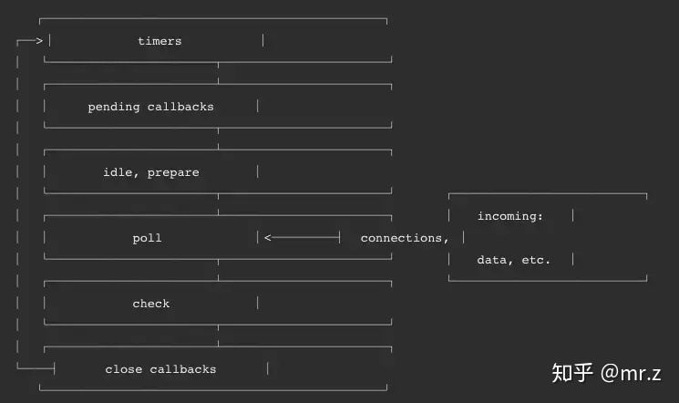

# 浏览器环境下的事件循环
```js
1. 执行栈与事件队列
执行栈：
当javascript代码执行的时候会将不同的变量存于内存中的不同位置：堆（heap）和栈（stack）中来加以区分。其中，堆里存放着一些对象。而栈中则存放着一些基础类型变量以及对象的指针。
而当一系列方法被依次调用的时候，因为js是单线程的，同一时间只能执行一个方法，于是这些方法被排队在一个单独的地方。这个地方被称为执行栈。
事件队列：
js碰到异步任务，则会将其放入事件队列。等待执行栈中所有的任务执行完毕，主线程处于闲置状态时，会执行。
2. 异步任务
不同的异步任务被分为两类：微任务（micro task）和宏任务（macro task）
宏任务：script、setTimeout、setInterval、setImmediate
微任务：Process.nextTick（Node独有）、Promise.then() resolve()、Object.observe(废弃)、MutationObserver（具体使用方式查看这里）
在当前执行栈为空的时候，主线程会 查看微任务队列是否有事件存在。如果不存在，那么再去宏任务队列中取出一个事件并把对应的回到加入当前执行栈；如果存在，则会依次执行队列中事件对应的回调，直到微任务队列为空，然后去宏任务队列中取出最前面的一个事件，把对应的回调加入当前执行栈...如此反复，进入循环。

`当前执行栈执行完毕时会立刻先处理所有微任务队列中的事件，然后再去宏任务队列中取出一个事件。同一次事件循环中，微任务永远在宏任务之前执行。`
```

# node下的事件循环

```js
node中事件循环的实现是依靠的libuv引擎。
Node的Event loop一共分为6个阶段，每个细节具体如下：
1. timers: 执行setTimeout和setInterval中到期的callback。
2. pending callback: 上一轮循环中少数的callback会放在这一阶段执行。
3. idle, prepare: 仅在内部使用。
4. poll: 最重要的阶段，执行pending callback，在适当的情况下回阻塞在这个阶段。(两个主要功能：执行I/O回调。
处理轮询队列中的事件)
5. check: 执行setImmediate(setImmediate()是将事件插入到事件队列尾部，主线程和事件队列的函数执行完成之后立即执行setImmediate指定的回调函数)的callback。
6. close callbacks: 执行close事件的callback，例如socket.on('close'[,fn])或者http.server.on('close, fn)
poll阶段：
先查看poll queue中是否有事件，有任务就按先进先出的顺序依次执行回调。 当queue为空时，会检查是否有setImmediate()的callback，如果有就进入check阶段执行这些callback。但同时也会检查是否有到期的timer，如果有，就把这些到期的timer的callback按照调用顺序放到timer queue中，之后循环会进入timer阶段执行queue中的 callback。
check阶段：
check阶段专门用来执行setImmediate()方法的回调，当poll阶段进入空闲状态，并且setImmediate queue中有callback时，事件循环进入这个阶段。
timer阶段：
这个阶段以先进先出的方式执行所有到期的timer加入timer队列里的callback，一个timer callback指得是一个通过setTimeout或者setInterval函数设置的回调函数
`process.nextTick,setTimeout（setInterval与之相同）与setImmediate`
setImmediate()设计用于在当前poll阶段完成后check阶段执行脚本 。
setTimeout() 安排在经过最小（ms）后运行的脚本，在timers阶段执行。
当每个阶段完成后，如果存在 nextTick 队列，就会清空队列中的所有回调函数，并且优先于其他 microtask 执行。
```