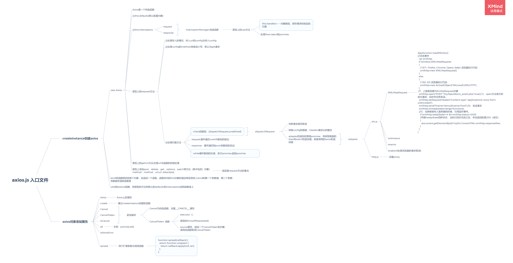

# axios.js 入口文件

## createInstance 创建 axios

### new Axios

- Axios 是一个构造函数
- ①this.defaults(默认配置对象)
- ②this.interceptors

      	- request
      	- response

- 原型上的 request 方法

      	- ①处理传入的情况，传入url和config与传入config
      	- ②处理config的method:转换成小写，默认为get请求
      	- ③处理拦截方法

      		- chain的数组：[dispatchRequest,undefined]
      		- request:循环遍历unshift数组的前边
      		- response：循环遍历到push到数组的后边
      		- while循环数组的长度，执行promise,返回promise

- 原型上的 getUri 方法:处理 url 与函数的拼接处理
- 原型上添加 post、delete、get、options、patch 等方法（其中包括）对象{method：method，url:url ,data:data}

      	- 底层是request方法的集合

### bind 将函数绑定到某个对象，会返回一个函数，函数体内的 this 对象的值会绑定到传入 bind 的第一个参数值，第二个参数将数据传递到函数里

### utils 的 extend 函数，将原型的方法和默认的 defaults 和 interceptors 加到函数身上

## axios 对象添加属性

### Axios

- Axios 上的属性

### create

- 通过 createInstance 创建的函数

### Cancel

### CancelToken

### isCancel

### all

- 本质：promise.all()

### isAxiosError

### spread

- 用于扩展参数与调用函数

      - function spread(callback) {

  return function wrap(arr) {
  return callback.apply(null, arr);
  };
  };

_XMind - Trial Version_
