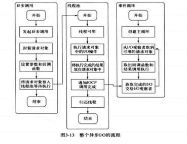

# node的认识
```js
Node.js 在浏览器外运行 V8 JavaScript 引擎（Google Chrome 的内核）。
特点：
单线程，异步I/O，事件驱动
```
# 请介绍一下require的模块加载机制
```js
// require 其实内部调用 Module._load 方法
Module._load = function(request, parent, isMain) {
 // 计算绝对路径
 var filename = Module._resolveFilename(request, parent);
 // 第一步：如果有缓存，取出缓存
 var cachedModule = Module._cache[filename];
 if (cachedModule) {
 return cachedModule.exports;
 // 第二步：是否为内置模块
 if (NativeModule.exists(filename)) {
 return NativeModule.require(filename);
 }
 /********************************这里注意了**************************/
 // 第三步：生成模块实例，存入缓存
 // 这里的Module就是我们上面的1.1定义的Module
 var module = new Module(filename, parent);
 Module._cache[filename] = module;
 /********************************这里注意了**************************/
 // 第四步：加载模块
 // 下面的module.load实际上是Module原型上有一个方法叫Module.prototype.load
 try {
  module.load(filename);
  hadException = false;
  } finally {
  if (hadException) {
    delete Module._cache[filename];
  }
  }
  // 第五步：输出模块的exports属性
  return module.exports;
};
```
# 请描述一下整个异步I/O的流程

# 官网的入门信息
```js
1. module.exports 和 export 之间有什么区别？
前者公开了它指向的对象。 后者公开了它指向的对象的属性。
2. npm 
npm 是 Node.js 标准的软件包管理器。
Yarn 是 npm 的一个替代选择。
npm install -g loadsh  //安装到全局的位置 通过指令npm root -g可以知道位置
3. package.json
项目的清单
"version": "1.0.0"  //第一个数字是主版本号，第二个数字是次版本号，第三个数字是补丁版本号。
license //指定软件包的许可证。
keywords //此属性包含与软件包功能相关的关键字数组。
4. package-lock.json  //该文件旨在跟踪被安装的每个软件包的确切版本
5. Node.js 包运行器 npx
npx 可以运行使用 Node.js 构建并通过 npm 仓库发布的代码
特性是，无需先安装命令即可运行命令。
6. 事件循环
`调用堆栈`是一个 LIFO 队列（后进先出）
`消息队列`：当调用 setTimeout() 时，则回调函数会被放入“消息队列”中。
7. process.nextTick()
nextTick会确保在下一个事件循环种代码已被执行
8.setImmediate() 与 setTimeout(() => {}, 0)（传入 0 毫秒的超时）、process.nextTick() 有何不同？
传给 process.nextTick() 的函数会在事件循环的当前迭代中（当前操作结束之后）被执行。setImmediate() 与 setTimeout(() => {}, 0)在下一个迭代中执行
8. 异步编程和回调
9. Promise
10. Node.js事件触发器
const EventEmitter = require('events')
const eventEmitter = new EventEmitter()
eventEmitter.on('start', () => {
  console.log('开始')
})
eventEmitter.emit('start')
11. 搭建服务器
const http = require('http')

const port = 3000

const server = http.createServer((req, res) => {
  res.statusCode = 200
  res.setHeader('Content-Type', 'text/plain')
  res.end('你好世界\n')
})

server.listen(port, () => {
  console.log(`服务器运行在 http://${hostname}:${port}/`)
})
======================express==============
const express = require('express')
const app = express()

app.use(
  express.urlencoded({
    extended: true
  })
)
app.use(express.json())
app.post('/todos', (req, res) => {
  console.log(req.body.todo)
})
12. 文件
path.resolve() 获得相对路径的绝对路径计算
path.normalize() 当包含诸如 .、.. 或双斜杠之类的相对说明符时，其会尝试计算实际的路径
fs.readFile() 读取文件
fs.writeFile()
fs.mkdir() 或 fs.mkdirSync() 可以创建新的文件夹
s.readdir() 或 fs.readdirSync() 可以读取目录的内容。
13. 流
它们是一种以高效的方式处理读/写文件、网络通信、或任何类型的端到端的信息交换。
stream 模块 
```
# node.js写一个中间件
```js
// express是node.js的一个库
var express = require('express');
var app = express();

//当访问根目录时触发
app.get('/', function (req, res) {
   res.send('Hello Jshaman.com');
})

//自己的中间件
app.use(function(req,res,next){
   console.log("%s %s",req.method,req.url);
   next();
});

var server = app.listen(8000, function () {
   var host = server.address().address
   var port = server.address().port
   console.log(host, port);
})
```
<!-- # node.js的事件循环和js的不同
```js
Browser端执行所有的同步任务，然后看任务队列的宏任务和微任务。使微任务内嵌套微任务，也会将嵌套的微任务执行完毕后（这点上nodejs与browser是相同的，对应的就是清空微任务的队列），再去宏任务队列执行下一个宏任务。
node.js 端，如果涉及到同源宏任务的嵌套，仍会将同源任务放在一起，但是内部的任务会放在下一次事件循环时执行
``` -->