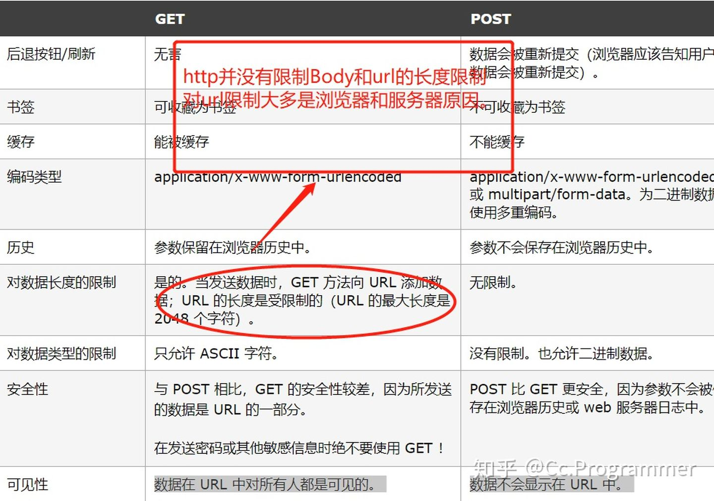

# instanceof底层原理
```js
功能：
instanceof 运算符用于测试构造函数的 prototype 属性是否出现在对象原型链中的任何位置
function instance_of(left, right) {
  const RP = right.prototype; // 构造函数的原型
  while(true) {
    if (left === null) {
      return false;
    }
    if (left === RP) { // 一定要严格比较
      return true;
    }
    left = left.__proto__; // 沿着原型链重新赋值
  }
}
console.log(Number instanceof Number)  // false
console.log(String instanceof String)  // false
console.log(null instanceof Object)   // false
```
# typeof
```js
console.log(typeof undefined)  //'undefined'
console.log(typeof true)    //'Boolean'
console.log(typeof "abc")   //'string'
console.log(typeof 123)           //'number'
console.log(typeof function(){})  //'function'
console.log(typeof null)
console.log(typeof {})
console.log(typeof [])
console.log(typeof Symbol()) //'symbol'
console.log(typeof BigInt('1')) //'bigint'
判断对象与数组
1. instanceof 
2. constructor 
arr.constructor === Array 
3. Object.prototype.toString.call(a) === '[object Array]';//true  
4. Array.isArray()
`Object.prototype.toString与toString()的区别`：
Object.prototype.toString.call()
区别是：this绑定
每个对象都有一个 toString() 方法，当该对象被表示为一个文本值时，或者一个对象以预期的字符串方式引用时自动调用。默认情况下，toString() 方法被每个 Object 对象继承。如果此方法在自定义对象中未被覆盖，toString() 返回 “[object type]”
```
# axios、fetch、ajax的区别
[axios、fetch、ajax](https://www.cnblogs.com/lyq1996/p/14485344.html)
```js
fetch()方法是暴露在全局作用域中的，包括主页面执行线程、模块和工作线程。调用这个方法，
浏览器就会向给定 URL 发送请求。
ajax:
onreadystatechange	存储函数（或函数名），每当 readyState 属性改变时，就会调用该函数。
readyState	
存有 XMLHttpRequest 的状态。从 0 到 4 发生变化。
0: 请求未初始化
1: 服务器连接已建立
2: 请求已接收
3: 请求处理中
4: 请求已完成，且响应已就绪
status	
200: "OK"
404: 未找到页面
```
# 如何实现 new 运算符
```js
1. 创建一个空对象，作为将要返回的实例对象。
2. 将这个空对象的原型，指向构造函数的prototype属性。
3. 将这个空对象赋值给函数内部的this关键字。
4. 开始执行构造函数内部的代码。
5. 如果构造函数内有返回值且为对象类型，则返回该对象，否则返回上面创建的实例对象。
// 参考js下的文件
let new2 = function(func) { 
  //创建一个空对象 o，并且继承构造函数的原型对象
  let o = Object.create(func.prototype);
  //执行构造函数，并且上下文 this 指向 o 对象
  let k = func.call(o);
  //如果构造函数返回的是对象就返回该对象，否则返回 o 对象
  if(typeof k === 'object') {
    return k
  }else {
    return o
  }
}
```
# arguments
arguments 是一个类似数组的对象, 对应于传递给函数的参数。
arguments对象是所有函数中可用的局部变量。你可以使用arguments对象在函数中引用函数的参数。
```js
将 arguments 转换为真正的数组:
let args = Array.from(arguments);
let args = [...arguments];
```
```js
// 属性
1. arguments.callee 指向当前执行的函数。
2. arguments.caller 指向调用当前函数的函数。
3. arguments.length 指向传递给当前函数的参数数量。
```
# 图片懒加载、预加载
```js
图片预加载：就是在网页全部加载之前，提前加载图片，当用户需要查看时可直接从本地缓存中渲染，以提供给用户更好的体验，减少等待的时间。
图片懒加载（缓载）：延迟加载图片或符合某些条件时才加载某些图片。
懒加载的好处：
1. 能提升用户的体验
2. 减少无效资源的加载
3. 防止并发加载的资源过多会阻塞js的加载
1. 懒加载的实现
  <html lang="en">
  <head>
    <meta charset="UTF-8">
    <title>Lazyload</title>
    <style>
      .image-item {
        display: block;
        margin-bottom: 50px;
        height: 200px; 
        /* 一定记得设置图片高度 */
      }
    </style>
  </head>
  <body>
    
    
    
    
    
    
    
    
    
    
    
    
    <script>
    // 方式一
      var viewHeight = document.documentElement.clientHeight//获取可视区高度
      function lazyload() {
        var eles = document.querySelectorAll('img[data-original][lazyload]')
        Array.prototype.forEach.call(eles, function (item, index) {
          var rect
          if (item.dataset.original === "")
            return
          rect = item.getBoundingClientRect()// 用于获得页面中某个元素的左，上，右和下分别相对浏览器视窗的位置
          if (rect.bottom >= 0 && rect.top < viewHeight) {
            !function () {
              var img = new Image()
              img.src = item.dataset.original
              img.onload = function () {
                item.src = img.src
              }
              item.removeAttribute("data-original")//移除属性，下次不再遍历
              item.removeAttribute("lazyload")
            }()
          }
        })
      }
      lazyload()//刚开始还没滚动屏幕时，要先触发一次函数，初始化首页的页面图片
      document.addEventListener("scroll",lazyload)
      // 方式二：echo.js

    </script>
  </body>
  </html>

2. 预加载
    1. 使用css进行图片预加载
    body:after {
        content: "";
        display: block;
        position: absolute;
        background: url("../image/...") no-repeat 0 0；
        height: 0
    }
    2. 使用css+js进行图片预加载
      .preload-img:after{
            content:"",
            background: url("../image/...") no-repeat 0 0；
        }
      $(function(){
          $("#img").addClass("preload-img")
      })
      // 另一种使用数组先保存图片，然后遍历查找值
    3. 使用ajax
    window.onload = function() {  
      setTimeout(function() {  
          // XHR to request a JS and a CSS  
          var xhr = new XMLHttpRequest();  
          xhr.open('GET', 'http://domain.tld/preload.js');  
          xhr.send('');  
          xhr = new XMLHttpRequest();  
          xhr.open('GET', 'http://domain.tld/preload.css');  
          xhr.send('');  
          // preload image  
          new Image().src = "http://domain.tld/preload.png";  
      }, 1000);  
    }; 
    4. 使用PreloadJS库
```
# 实现页面加载进度条
```js
1. h5的progress
2. 根据请求的返回的加载进度
```
# 手动实现 parseInt
```js
const _parseInt = (str, radix) => {
  // 不为string类型先转化为string 类型
  if (typeof str !== 'string') str = String(str)
  // 删除首尾空白
  str = str.trim()
  // 正则匹配[+|-]?[0]?[Xx]?[0-9a-fA-F]+
  const regex = /^(?<fuhao>[\+|\-]*)(?<radix>[0]?[Xx]?)(?<num>[0-9a-fA-F]+)/
  // 无法匹配返回NaN
  if (!regex.test(str)) return NaN
  // 匹配出符号、进制、数字三个分组
  const groups = str.match(regex).groups
  // radix的有效范围为 2-36
  if (radix && (radix < 2 || radix > 36)) return NaN
  // 如果没有指定radix, radix 会有以下默认值
  if (!radix) {
    if (groups.radix.toUpperCase() === '0X') radix = 16
    else if (groups.radix === '0') radix = 8
    else radix = 10
  }
  // 挨个字符串解析，如果遇到无法解析时则停止解析，返回已经解析好的整数
  let splitArr = groups.num.split('')
  const arr = []
  for(let i = 0; i < splitArr.length; i++) {
    // 根据charCode来做转行为实际数据, 0-9为[48-57],A-F为[65-70]
    const charCode = splitArr[i].toUpperCase().charCodeAt()
    let num 
    // 字符为[A-F]时, 实际数字为charCode -55
    if(charCode >= 65) num = charCode - 55
    // 字符为[0-9]时, 实际数字为charCode - 48
    else num = charCode - 48
    // 当实际数字大于radix时, 无法解析则停止字符串遍历
    if (num > radix) {
      break
    } else {
      arr.push(num)
    }
  }
  const len = arr.length
  // 当实际数字数组长度为0时, 返回NaN
  if(!len) return NaN
  let result = 0
  // 依次解析实际数字数组, 组合成真正的数字
  for(let i = 0; i < len; i++) {
    const num = arr[i] * Math.pow(radix, len - i - 1)
    result += num
  }
  // 算法匹配到的正负号
  return result * (groups.fuhao === '-' ? -1 : 1)
}

```
# 手写实现promise
[promise](https://www.cnblogs.com/lyq1996/p/14171617.html)
# call，apply，bind 三者用法和区别，原生实现 bind call apply
```js
call（this,arg1,arg2,arg3）
apply(this,[arg1,arg2])
bind(this,arg1,arg2)
bind不会立即调用，而是返回一个新函数，其中的this指向是创建bind的第一个参数，其他则会使用为参数。
改变原函数的 this 指向，即绑定上下文，返回原函数的拷贝
当 绑定函数 被调用时，bind的额外参数将置于实参之前传递给被绑定的方法。
注意，一个 绑定函数 也能使用 new 操作符创建对象,这种行为就像把原函数当成构造器，thisArg 参数无效。也就是 new 操作符修改 this 指向的优先级更高。
1. bind
//可以修改函数this指向。
//bind返回一个绑定了this的新函数boundFcuntion，例子中我们用bound表示。
//支持函数柯里化，我们在返回bound函数时已传递了部分参数2，在调用时bound补全了剩余参数。
//boundFunction的this无法再被修改，使用call、apply也不行。
Function.prototype.bind_ = function (obj) {
    if (typeof this !== "function") {
        throw new Error("Function.prototype.bind - what is trying to be bound is not callable");
    };
    var args = Array.prototype.slice.call(arguments, 1);
    var fn = this;
    //创建中介函数
    var fn_ = function () {};
    var bound = function () {
        var params = Array.prototype.slice.call(arguments);
        //通过constructor判断调用方式，为true this指向实例，否则为obj
        fn.apply(this.constructor === fn ? this : obj, args.concat(params));
    };
    fn_.prototype = fn.prototype;
    bound.prototype = new fn_();
    return bound;
};
2. call方法
Function.prototype._call = function(base, ...args) { // 拓展Function原型，使用Rest操作符接收剩余参数
    base = base || window; // 传递绑定的对象为null或undefined时指向window
    base.fn = this; // 调用_call时的this指向的是调用者也就是函数对象，将函数对象赋值给base对象的一个属性
    var result = base.fn(...args); // 调用base.fn时，fn中的this指针指向的是base，并使用Spread操作符展开参数传参
    delete base.fn; // 删除base对象的fn属性
    return result; // 将返回值返回
}
3. apply
Function.prototype._apply = function(base, args) { // 拓展Function原型
    base = base || window; // 传递绑定的对象为null或undefined时指向window
    base.fn = this; // 调用_apply时的this指向的是调用者也就是函数对象，将函数对象赋值给base对象的一个属性
    var result = base.fn(...args); // 调用base.fn时，fn中的this指针指向的是base，并使用Spread操作符展开参数传参
    delete base.fn; // 删除base对象的fn属性
    return result; // 将返回值返回
}
```
# 垃圾回收机制
```js
JavaScript 中的内存管理是自动执行的，而且是不可见的。
`可达性`
1. 有一组基本的固有可达值，由于显而易见的原因无法删除。例如:
本地函数的局部变量和参数
当前嵌套调用链上的其他函数的变量和参数
全局变量
还有一些其他的，内部的这些值称为根。
2. 如果引用或引用链可以从根访问任何其他值，则认为该值是可访问的。
基本方法：
1. 标记清除法
标记根==>标记他们的引用以及子孙的引用==>不能访问的对象被认为是不可访问的，将被删除:
优化：
分代回收机制：新生代和老生代表。From和To两个空间。
增量回收
空闲时间收集
2. 引用计数
释放引用次数为0的值的内存
引用计数在代码中存在循环引用时会出现问题。
`内存管理`：
1. 通过 const 和 let 声明提升性能
2. 隐藏类和删除操作
3. `内存泄漏`
 ==================造成内存泄露的操作和内存泄露后的方法====================
 操作：1.  意外的全局变量
      2. 被遗忘的定时器或回调函数
      3. 脱离DOM的使用
      4. 闭包
方法： 1.  利用chorme的插件进行分析内存占用情况
      2. 在退出函数前将不使用的变量删除
      3. 避免变量的循环赋值和引用
      4. 静态分配与对象池
```
# 闭包
```js
隐藏一个变量，函数外部访问不到里面的值
保护函数内的变量安全。在内存中维持一个变量
1. 闭包使用的场景
  1. 定时器
  2. 回调
  3. 函数的防抖节流
  4. 封装私有变量
  5. 函数柯里化
  6. 不使用循环返回数组
2. 为啥会有闭包？
能够读取其他函数内部变量的函数。
3. 闭包的缺点
  1. 造成内存泄露（只是针对IE）
  2. 比普通函数占用更多的内存。
```
# 变量提升、函数提升
```js
1. 函数提升优于变量提升执行
2. 变量提升只提升声明，函数提升声明和赋值
3. 变量声明不会覆盖变量或函数的赋值
4. 函数声明会覆盖同名的变量声明和函数赋值，但不会覆盖变量赋值!
5. 立即执行函数(IIFE)中存在局部作用域，变量只会提升到函数内的顶部
```
# websocket的原理
```js
 缺点：会出现半死不活的状态。因为中间存在巨大的网络链路，导致会发生断点连接失败
 HTTP 1.1中的keep-alive connection是指在一次TCP连接上完成多次请求，但是对每个请求都要单独发header
 WebSocket 看成是 HTTP 协议为了支持长连接所打的一个大补丁。建立在TCP之上的。
 `websocket分为握手和数据传输阶段，即进行了HTTP握手 + 双工的TCP连接。`
 1. 握手阶段
 客户端发送消息：
  GET /chat HTTP/1.1
  Host: server.example.com
  Upgrade: websocket
  Connection: Upgrade
  Sec-WebSocket-Key: dGhlIHNhbXBsZSBub25jZQ==
  Origin: http://example.com
  Sec-WebSocket-Version: 13
  服务端返回消息
  HTTP/1.1 101 Switching Protocols
  Upgrade: websocket
  Connection: Upgrade
  Sec-WebSocket-Accept: s3pPLMBiTxaQ9kYGzzhZRbK+xOo=
  `Sec-WebSocket-Key`:Base64 encode
 2. 传输阶段
  frame形式传输的
  a、大数据的传输可以分片传输，不用考虑到数据大小导致的长度标志位不足够的情况。
  b、和http的chunk一样，可以边生成数据边传递消息，即提高传输效率。
  
  [参数参考](https://www.jianshu.com/p/3444ea70b6cb)
 3. 使用
 var socket;
  $("#connect").click(function(event){
      socket = new WebSocket("ws://127.0.0.1:8000/chat");
      socket.onopen = function(){
      alert("Socket has been opened");
      }
      socket.onmessage = function(msg){
      alert(msg.data);
      }
      socket.onclose = function() {
      alert("Socket has been closed");
      }
  });
  $("#send").click(function(event){
      socket.send("send from client");
  });
  $("#close").click(function(event){
      socket.close();
  })
```
# js的内置对象有哪些？
```js
1. 值属性：Infinity、NaN、null、undefined
2. 函数属性：eval()、parseFloat()、parseInt()
3. 基本对象：Object、Function、Boolean、Error
4. 数字和日期对象
5. 字符串
6. 可索引的集合对象
7. 使用键的集合对象
8. 矢量集合
9. 结构化数据，如JSON
10. Promise、Reflect、Proxy
11. arguments
```
# 继承
```js
1. 原型链继承
注意：通过此方法继承时，不能使用对象字面量创建原型方法，因为会重写原型链。
缺点：1.引用类型的原型共用，会影响所有的实例。2.构建实例时，不能向里边传入参数。不能与构造函数一样。
2. 借用构造函数继承 (经典继承)
思路：在子类构造函数中调用父类构造函数。
function Person(name){
  this.name=name;
}
function Second(){
  //即传入参数，又定义自己的属性
Person.call(this,'qwqw')
this.age=12;
}
let s=new Second();
console.log('s.name',s.name);
console.log('s.age',s.age);
缺点：方法都在构造函数中定义，函数不能复用。
3. 组合继承
思路：使用原型链继承原型上的属性和方法，而通过盗用构造函数继承实例属性
4. 原型式继承
思想：实现对象之间的信息共享
    // function object(o){
    //   function F(){};
    //   F.prototype=o;
    //   return new F();
    // }
    var person={
      name:'ssss',
      friends:['k','l','o']
    }
    var another=Object.create(person,{
      name:{
        value:"SSS"
      }
    });
    alert(another.name)  //SSS
5. 寄生式继承
思路：创建一个实现继承的函数，以某种方式增强对象，然后返回这个对象。
function createAnother(original){ 
 let clone = object(original); // 通过调用函数创建一个新对象
 clone.sayHi = function() { // 以某种方式增强这个对象
   console.log("hi"); 
 }; 
 return clone; 
}// 返回这个对象
======使用=======
let person = { 
 name: "Nicholas", 
 friends: ["Shelby", "Court", "Van"] 
};
let anotherPerson = createAnother(person); 
anotherPerson.sayHi(); // "hi"
}
缺点：
6. 寄生式组合继承
function inheritPrototype(subType, superType) { 
 let prototype = object(superType.prototype); // 创建对象
 prototype.constructor = subType; // 增强对象 
 subType.prototype = prototype; // 赋值对象
}
function SuperType(name) { 
 this.name = name; 
 this.colors = ["red", "blue", "green"]; 
} 
SuperType.prototype.sayName = function() { 
 console.log(this.name); 
}; 
function SubType(name, age) { 
 SuperType.call(this, name); 
 this.age = age; 
} 
inheritPrototype(SubType, SuperType); 
SubType.prototype.sayAge = function() { 
 console.log(this.age); 
};。
7. ES6继承
class Parent{
    constructor(name){
        this.name = name
    }
    getName(){
        return this.name
    }
}

class Son extends Parent{
    constructor(name, age){
        super(name)
        this.age = age
        console.log(new.target)
    }
    introduce(){
        return `我叫做${this.name}，今年${this.age}岁了`
    }
}
const s = new Son("小李", 8)
console.log(s.introduce()) // 我叫做小李，今年8岁了
console.log(s.getName()) // 小李
```
# 原型和原型链
```js
`原型`
js中的对象，都有其对应的prototype属性，其中包含共享的属性和方法。
`原型链`
每个构造函数都有一个原型对象，原型有一个属性指回构造函数，而实例有一个内部指针指向原型。如果原型是另一个类型的实例呢？那就意味
着这个原型本身有一个内部指针指向另一个原型，相应地另一个原型也有一个指针指向另一个构造函
数。这样就在实例和原型之间构造了一条原型链。
```
# 观察者模式，和发布订阅模式，有什么区别？
```js
1. 观察者模式：实现松耦合(loosely coupled)
观察者模式里面，changed()方法所在的实例对象，就是被观察者（Subject，或者叫Observable），它只需维护一套观察者（Observer）的集合，这些Observer实现相同的接口，Subject只需要知道，通知Observer时，需要调用哪个统一方法就好了：

```
# valueOf() toString()
{}的valueof()结果是{},toString的结果是[Object object]
[] 的valueof()结果是[],toString的结果是’’
```js
toString()方法：返回对象的字符串表示。
console.log('222'.toString())    // '222'
console.log((222).toString())           // '222'
0.toString();//Uncaught SyntaxError: Invalid or unexpected token
console.log({name:'22'}.toString())   // '[object Object]'
console.log(true.toString())     //'true'
console.log([1,3,4].toString())  //1 ,3,4
console.log(function(){alert('eee')}.toString())  //'function(){alert('eee')'
console.log(new Error('错误').toString())  //'Error: 错误'
console.log(new Date().toString())  //Wed Jul 28 2021 15:58:46 GMT+0800 (中国标准时间)
Date.toString();//"function Date() { [native code] }"
String.toString(); //"function String() { [native code] }"
RegExp.toString();//"function RegExp() { [native code] }"
========================================================================
valueOf()方法：返回指定对象的原始值
console.log('222'.valueOf())    // '222'
console.log((222).valueOf())           // 222
//0.valueOf();//Uncaught SyntaxError: Invalid or unexpected token
console.log({name:'22'}.valueOf())   // {name:'22'}
console.log(true.valueOf())     //true
console.log([1,3,4].valueOf())  //[1, 3, 4]
console.log(function(){alert('eee')}.valueOf())  //'function(){alert('eee')'
console.log(new Error('错误').valueOf())  //'Error: 错误'
console.log(new Date().valueOf())  //1627459767493
console.log(Date.valueOf())
Date.valueOf();//function Date() { [native code] }
String.valueOf(); //function String() { [native code] }
RegExp.valueOf();//function RegExp() { [native code] }
共同点：在 JavaScript 中，toString()方法和valueOf()方法，在输出对象时会自动调用。
不同点：二者并存的情况下，在数值运算中，优先调用了valueOf，字符串运算中，优先调用了toString。
共同的缺点：无法获取null和undefined的值
```
# tofixed()的原理
```js
四舍六入五成双:“四”是指≤4 时舍去，"六"是指≥6时进上，"五"指的是根据5后面的数字来定，当5后有数时，舍5入1；当5后无有效数字时，需要分两种情况来讲：①5前为奇数，舍5入1；②5前为偶数，舍5不进。（0是偶数）
function fixed(num, digits){
   let dig = Math.pow(10, digits);
   return Math.round(num * dig) / dig; //Math.round采用四舍五入的方法
}
```

# 作用域
```js
1. 全局作用域 ----global/window
全局变量拥有的作用域
在函数内部或代码块中没有定义的变量实际上是作为 window/global 的属性存在，而不是全局变量。
2. 函数作用域 ---- 'function'
在函数内部定义的局部变量所拥有的作用域，外部只能通过return 或者闭包访问到
3. 块级作用域 ---- {}
let
4. 动态作用域 ----this
this根据调用的不同，指向不同
```
# TCP UDP区别
TCP:
1. 面向连接
2. 仅支持单播传输
3. 面向字节流
4. 可靠传输
5. 提供拥塞控制
6. TCP提供全双工通信
使用场景：web browsing email 文件传输 线上游戏
UDP:
1. 面向无连接
2. 有单播，多播，广播的功能
3. UDP是面向报文的
4. 不可靠性
使用场景：app应用 DNS查找 广播传输,流媒体  线上游戏
# 客户端存储
```js
`本地数据存储`
1. `cookie`最初用于在客户端存储会话信息，不可跨域名性 (4k)
服务器在响应HTTP 请求时，通过发送 Set-Cookie HTTP 头部包含会话信息。
cookie的组成：名称、值、域、路径、过期时间、安全标志。
document.cookie 可获取所有的cookie字符串
`子cookie`:单个cookie 存储的小块数据，本质上是使用 cookie 的值在单个 cookie 中存储多个名/值对
`Cookie机制`是通过检查客户身上的“通行证”来确定客户身份
  1. 缺点：
    数量和长度有限制
    在请求头上带着数据安全性差
  2. 优点
    可控制过期时间，使其不会长期有效
    可扩展、可用性比较好，可跨域共享
    可加密减少cookie被破解的可能性
    兼容性好
2. Web Storage (一般浏览器支持的是5M大小)
  2.1 localStorage 永久存储机制
  2.2 sessionStorage 跨会话的存储机制
  `Session机制`是服务器端使用的一种记录客户端状态的机制。
`Srotage和cookie的区别`
cookie 在每次请求一个新的页面的时候都会被发送过去，在浏览器和服务器间来回传递，这样无形中浪费了带宽。
cookie 可以设定访问域，在同源窗口中可以共享，而 web storage 受同源策略限制。
3. IndexedDB 
使用对象存储而不是表格保存数据。异步请求
`离线存储（应用缓存）`：一般存储的是网页
1. 配置manifest文件
<!DOCTYPE HTML>
<html manifest="demo.appcache">
...
</html>
2. Cache Storage：定义在 Service Worker 的规范中，配合 Service Worker 进行离线缓存
```
[cookie、session](https://www.cnblogs.com/l199616j/p/11195667.html)
# this
this:是一个对象，函数执行的上下文对象。指代函数当前的运行环境
```js
谁调用，函数就指向谁。
情况一：普通函数调用，则指向全局window。在非严格模式下this就是window，严格模式下是undefined
       匿名函数的this,指的是window
情况二：对象调用，则指向对象
情况三：构造函数使用，则指向实例
情况四：箭头函数中的this,指的是父级的上下文
情况五：apply、call、bind改变this的指向
情况六：事件中使用this,则表示事件绑定的元素DOM
`new.target`:检测函数是否使用 new 关键字调用的 new.target 属性
```
# 数据类型
```js
6种简单数据类型：Undefined、Null、Boolean、Number、String 和 Symbol、bigInt（指安全存储、操作大整数）
let sym = Symbol(); 
console.log(typeof sym); // symbol
注意：1. Symbol不能用for...in或者for..of循环
     2. 可以通过 Object.getOwnPropertySymbols() 和 Reflect.ownKeys() 取到
     3. 使用[]取值
     4. Symbol.for()和Symbol.keyFor()方法
引用数据类型：Object
```
# 数组的方法（ES6、ES5）
```js
空位的处理
ES5 `forEach() , filter() , every() 和 some() 都会跳过空位。
map() 会跳过空位，但会保留这个值
join() 和 toString() 会将空位视为 undefined ，而 undefined 和 null 会被处理成空字符串。`
ES6 则是明确将空位转为 undefined 。
改变数组的方法：
1. pop push
2. shift unshift
3. reverse
4. sort 
5. splice
6. [1, 2, 3, 4, 5].copyWithin(0, 3)    在当前数组内部，将指定位置的成员复制到其他位置（会覆盖原有成员），然后返回当前数组。
7. arr.fill(target, start, end) 使用给定的值，填充一个数组
不会改变数组的方法：
1. forEach
2. map
forEach、map的区别：
  1. map有返回值，forEach没有返回值，返回结果为undefined(没有return)
  2. forEach()会跳过空值，但是map会跳过空值，但是会保留这个值
  3. forEach无法中途跳出循环,break或return都不能奏效
3. filter
4. every
5. some
6. reduce
7. reduceRight
8. indexOf 、lastIndexOf
9. Array.from()  ----es6
10. Array.of() 将一组值转换成数组，类似于声明数组    ---es6
11. arr.find(callback) 找到第一个符合条件的数组成员
12. arr.findIndex(callback) 找到第一个符合条件的数组成员的索引值
13. arr.includes() 判断数中是否包含给定的值
14. entries()，keys()和values()
15. slice()
16. concat
```
# this的指向问题
```js
var num1=1;
var num2=2;
function cal(){
  var num1=10,num2=20;
  console.log(this.num1+this.num2)
}
new cal()  //NAN
cal()    //3
var callbind=cal.bind({num1=100,num2=200}) //报语法错误
```
# 使用vue自定义指令实现图片的懒加载
```js
IntersectionObserver API
import img from "@/assets/logo.png";
let timer = null; // 创建一个监听器
let observer = new IntersectionObserver((entries) => {
  // entries是所有被监听对象的集合
  entries.forEach((entry) => {
    if (entry.isIntersecting || entry.intersectionRatio > 0) {
      // 当被监听元素到临界值且未加载图片时触发。
      !entry.target.isLoaded && showImage(entry.target, entry.target.data_src);
    }
  });
});
function showImage(el, imgSrc) {
  const img = new Image();
  img.src = imgSrc;
  img.onload = () => {
    el.src = imgSrc;
    el.isLoaded = true;
  };
}
export default {
  // 这里用inserted和bind都行，因为IntersectionObserver时异步的，以防意外还是用inserted好一点  // inserted和bind的区别在于inserted时元素已经插入页面，能够直接获取到dom元素的位置信息。
  inserted(el, binding, vnode) {
    clearTimeout(timer); // 初始化时展示默认图片
    el.src = img; // 将需要加载的图片地址绑定在dom上
    el.data_src = binding.value;
    observer.observe(el);
    // 防抖，这里在组件卸载的时候停止监听
    const vm = vnode.context;
    timer = setTimeout(() => {
      vm.$on("hook:beforeDestroy", () => {
        observer.disconnect();
      });
    }, 20);
  }, // 图片更新触发
  update(el, binding) {
    el.isLoaded = false;
    el.data_src = binding.value;
  },
};
Vue.directive("image", image);
<div v-for="(item, index) in imgSrc" :key="index">
  
</div>
`使用原生js实现图片的懒加载`
var imgs = document.querySelectorAll('img');
//用来判断bound.top<=clientHeight的函数，返回一个bool值
function isIn(el) {
    var bound = el.getBoundingClientRect();
    var clientHeight = window.innerHeight;
    return bound.top <= clientHeight;
} 
//检查图片是否在可视区内，如果不在，则加载
function check() {
    Array.from(imgs).forEach(function(el){
        if(isIn(el)){
            loadImg(el);
        }
    })
}
function loadImg(el) {
    if(!el.src){
        var source = el.dataset.src;
        el.src = source;
    }
}
window.onload = window.onscroll = function () { //onscroll()在滚动条滚动的时候触发，采用节流
    check();
}
```
# 给定一个包括 n 个整数的数组 nums 和 一个目标值 target。找出 nums 中的三个整数，使得它们的和与 target 最接近。返回这三个数的和。假定每组输入只存在唯一答案。
例如，给定数组 nums = [-1，2，1，-4], 和 target = 1.
与 target 最接近的三个数的和为 2. (-1 + 2 + 1 = 2).
```js
var threeSumClosest = function(nums, target) {
    if (nums.length <= 3) {
        return nums.reduce(function(prev, curr){
            return prev + curr;
        });
    }
    nums.sort(function(a, b){
        return a-b;
    })

    var left,right;
    var diff = target - nums[0] - nums[1] - nums[2];
    var sum;

    for (var i=0; i<nums.length; i++) {
        left = i + 1;
        right = nums.length - 1;
        while(left < right) {
            sum = nums[i] + nums[left] + nums[right]
            if (Math.abs(diff) > Math.abs(target - sum)) {  //注意这里对比的是绝对值
                diff = target - sum;
            }
            if (diff === 0) return target;  //相加等于target，此时直接返回
            if (target - sum > 0) {
                left++;
            } else {
                right--;
            }
        }
    }

    return target - diff;
};
```
# typeof null==='Object'
```js
历史遗留问题
这个问题的产生可以追溯到JavaScript的第一个版本1，在这个版本中，单个值在栈中占用32位的存储单元，而这32位的存储单元又可以划分为类型标签(1-3位)和实际数据，类型标签存储于低位中。
null中第0位、第1位、第二位都为0，满足'Object'
```
# caller与callee的区别
```js
1. callee是arguments的一个属性（arguments另一个属性是length）
arguments.callee 指向当前执行的函数。
区别：1. 只有在函数执行时才有效
    2. 它有一个length属性，可以用来获得形参的个数
    3. 它可以用来递归匿名函数
2. caller返回一个函数被调用的环境
Function.caller指的是返回调用指定函数的函数（指的是调用它的函数）
如果是全局引用，则对应的是null
3. 使用场景：
在匿名递归函数中使用 arguments.callee
```
# 事件委托
```js
window.onload = function(){
　　var oUl = document.getElementById("ul1");
　　oUl.onclick = function(ev){
　　　　var ev = ev || window.event;
　　　　var target = ev.target || ev.srcElement;
　　　　if(target.nodeName.toLowerCase() == 'li'){
　 　　　　　　 alert(123);
　　　　　　　  alert(target.innerHTML);
　　　　}
　　}
}
适合用事件委托的事件：click，mousedown，mouseup，keydown，keyup，keypress。
```
# 阻止事件冒泡和阻止事件的默认行为
```js
事件传播的阻止方法:
在W3C中，使用stopPropagation()方法。
在IE下使用cancelBubble = true方法。
阻止默认行为：
在W3c中，使用preventDefault（）方法。
在IE下return false。
const EventUtils = {
  // 分别使用dom0||dom2||IE方式 来绑定事件
  // 添加事件
  addEvent: function(element, type, handler) {
    if (element.addEventListener) {
      element.addEventListener(type, handler, false);
    } else if (element.attachEvent) {
      element.attachEvent("on" + type, handler);
    } else {
      element["on" + type] = handler;
    }
  },

  // 移除事件
  removeEvent: function(element, type, handler) {
    if (element.removeEventListener) {
      element.removeEventListener(type, handler, false);
    } else if (element.detachEvent) {
      element.detachEvent("on" + type, handler);
    } else {
      element["on" + type] = null;
    }
  },

  // 获取事件目标
  getTarget: function(event) {
    return event.target || event.srcElement;
  },

  // 获取 event 对象的引用，取到事件的所有信息，确保随时能使用 event
  getEvent: function(event) {
    return event || window.event;
  },

  // 阻止事件（主要是事件冒泡，因为 IE 不支持事件捕获）
  stopPropagation: function(event) {
    if (event.stopPropagation) {
      event.stopPropagation();
    } else {
      event.cancelBubble = true;
    }
  },

  // 取消事件的默认行为
  preventDefault: function(event) {
    if (event.preventDefault) {
      event.preventDefault();
    } else {
      event.returnValue = false;
    }
  }
};
```
# get和post的区别
```js

1. get是获取数据的，而post是提交数据的。
2. GET 用于获取信息，是无副作用的，是幂等的，且可缓存， 而POST 用于修改服务器上的数据，有副作用，非幂等，不可缓存。
3. 安全性：post比get更安全
4. get请求比post请求快
5. get会有缓存，而post不会
6. url的请求长度一般都是由浏览器和web服务器决定和设置的。
```
# requestAnimaionFrame
```js
1. 定义
浏览器用于定时循环操作的一个接口，对动画有一个统一的刷新机制。
   1. 只绘制哪些对用户可见的动画
   2. 会把每一帧的所有DOM操作集中起来，在一次重绘或重流中使用，紧跟浏览器的刷新频率，每秒60帧
   3. 窗口没激活，则动画停止
function updateProgress() { 
 var div = document.getElementById("status"); 
 div.style.width = (parseInt(div.style.width, 10) + 5) + "%"; 
 if (div.style.left != "100%") { 
 requestAnimationFrame(updateProgress); 
 } 
} 
requestAnimationFrame(updateProgress);
2. cancelAnimationFrame
3. 通过 requestAnimationFrame 节流
let enabled = true; 
function expensiveOperation() { 
 console.log('Invoked at', Date.now()); 
} 
window.addEventListener('scroll', () => { 
 if (enabled) { 
 enabled = false; 
 window.requestAnimationFrame(expensiveOperation); 
 window.setTimeout(() => enabled = true, 50); 
 } 
});
```
# 强制类型转换和隐式转换
```js
强类型转换：
String（），Number（），Boolean（），
parseInt() parseFloat() toString()
隐式转换
1. 操作符 加减、布尔值、乘性操作符、取反、++ -- 
2. 判断语句 while if
```
# js的事件模型
```js
1. 事件流
  事件冒泡 IE
  事件捕获
  DOM事件流： 事件捕获阶段、事件目标阶段、事件冒泡阶段
2. 事件处理程序
   1. HTML 事件处理程序
   2. DOM0 事件处理程序
   3. DOM2 事件处理程序
    addEventListener（removeEventListenter） false（默认）表示事件冒泡，传入true表示事件捕获。
   4. IE 事件处理程序
    attachEvent（detachevent）
   5. 跨浏览器事件处理程序
   var EventUtil = { 
  addHandler: function(element, type, handler) { 
    if (element.addEventListener) { 
      element.addEventListener(type, handler, false); 
      } else if (element.attachEvent) { 
      element.attachEvent("on" + type, handler); 
      } else { 
      element["on" + type] = handler; 
      } 
    }, 
  removeHandler: function(element, type, handler) { 
      if (element.removeEventListener) { 
      element.removeEventListener(type, handler, false); 
      } else if (element.detachEvent) { 
      element.detachEvent("on" + type, handler); 
      } else { 
      element["on" + type] = null; 
      } 
    } 
  };
```
# Object的循环遍历
```js
1. for...in 
只遍历对象自身的和继承的可枚举的属性。(不包含Symbol属性)
2. Object.keys(obj) 
返回对象自身的所有可枚举的属性的键名。
3. Object.getOwnPropertyNames(obj)
Object.getOwnPropertyNames返回一个数组，包含对象自身的所有属性（不含 Symbol 属性，但是包括不可枚举属性）的键名。
4. Object.getOwnPropertySymbols(obj)
Object.getOwnPropertySymbols返回一个数组，包含对象自身的所有 Symbol 属性的键名。
6. Reflect.ownKeys(obj)
Reflect.ownKeys返回一个数组，包含对象自身的（不含继承的）所有键名，不管键名是 Symbol 或字符串，也不管是否可枚举。
`for..in和for..of的区别`
1. for in遍历的是数组的索引（即键名），而for of遍历的是数组元素值。
2. for in会遍历原型上的属性，性能差。
```
# vue-router
```JS
`更新视图而不重新请求页面`
1. hash模式
window.location.hash
hash虽然出现在URL中，但不会被包括在HTTP请求中。它是用来指导浏览器动作的，对服务器端完全无用，因此，改变hash不会重新加载页面。
hashchange事件
push()
replace()
每一次改变hash（window.location.hash），都会在浏览器的访问历史中增加一个记录
2. history模式
更改url,切换，但是不请求数据。
window.history.pushState(stateObject, title, URL)
window.history.replaceState(stateObject, title, URL)
3. 非浏览器环境准备了一个abstract模式
4. history.pushState()相比于直接修改hash的区别
  1. pushState设置的新URL可以是与当前URL同源的任意URL；而hash只可修改#后面的部分，故只可设置与当前同文档的URL
  2. pushState设置的新URL可以与当前URL一模一样，这样也会把记录添加到栈中；而hash设置的新值必须与原来不一样才会触发记录添加到栈中
  3. pushState通过stateObject可以添加任意类型的数据到记录中；而hash只可添加短字符串
  4. pushState可额外设置title属性供后续使用
```
# 树结构的一级转换成树结构
```js
function convert(source, parentId = 0){
    let trees = [];
    for (let item of source) {
      if(item.parentId === parentId) {
        let children = convert(source, item['id']);
        if(children.length) {
          item.children = children
        }
        trees.push(item);
      }
    }
    return trees;
  }
let list =[
    {id:1,name:'部门A',parentId:0},
    {id:2,name:'部门B',parentId:0},
    {id:3,name:'部门C',parentId:1},
    {id:4,name:'部门D',parentId:1},
    {id:5,name:'部门E',parentId:2},
    {id:6,name:'部门F',parentId:3},
    {id:7,name:'部门G',parentId:2},
    {id:8,name:'部门H',parentId:4}
];
const result = convert(list)
console.log(result)
```
# 箭头函数与普通函数的区别？
```js
1. 箭头函数都是匿名函数
2. 箭头函数的this指向，是上下文。普通函数this指向调用它的方法
3. 箭头函数不绑定arguments，取而代之用rest参数…解决
```
# 接口如何做到防刷？
```js
1. 根据ip限制访问频率
2. 验证码
3. 限制发送频率
4. 后端逻辑验证
增加时间戳
4.  接口访问监控
```
# 编写web端cookie的设置和获取方法;
```js
//写cookie
function setCookie(name,value){
　　var Days = 30;
　　var exp = new Date();
　　exp.setTime(exp.getTime() + Days*24*60*60*1000);
　　document.cookie = name + "="+ escape (value) + ";expires=" + exp.toGMTString();
}
//读取cookie
function getCookie(name){
　　var arr,reg=new RegExp("(^| )"+name+"=([^;]*)(;|$)");
　　if(arr=document.cookie.match(reg)){
　　　　return unescape(arr[2]);
　　}
　　else{
　　　　return null;
　　}
}
//删除cookie
function delCookie(name){
　　var exp = new Date();
　　exp.setTime(exp.getTime() - 1);
　　var cval=getCookie(name);
　　if(cval!=null){
　　　　document.cookie= name + "="+cval+";expires="+exp.toGMTString();
　　}
}
```
# 网站迁移http到https
[http-https](https://www.seozac.com/case-study/http-to-https/)
```js
https:采用非对称加密（公钥）和对称加密结合（私钥）
原理： 1. 客户端发起 SSL 握手消息给服务端要求连接。将它所支持的算法列表和一个用作产生密钥的随机数发送给服务器。
      2. 服务器从算法列表中选择一种加密算法，并将它和一份包含服务器公用密钥的证书发送给客户端；
      3. 客户端对服务器的证书进行验证（有关验证证书，可以参考数字签名），并抽取服务器的公用密钥；
      然后，再产生一个称作 pre_master_secret 的随机密码串，并使用服务器的公用密钥对其进行加密（将对称密钥采用公钥进行加密）
      4. 客户端与服务器端根据 pre_master_secret 以及客户端与服务器的随机数值独立计算出加密和 MAC密钥（参考 DH密钥交换算法）
      5. 客户端将所有握手消息的 MAC 值发送给服务器
      6. 服务器将所有握手消息的 MAC 值发送给客户端
网站迁移：

```
# 防抖节流
```js
function debounce(fn, wait, immediate) {
    let timer = null

    return function() {
        let args = arguments
        let context = this

        if (immediate && !timer) {
            fn.apply(context, args)
        }

        if (timer) clearTimeout(timer)
        timer = setTimeout(() => {
            fn.apply(context, args)
        }, wait)
    }
}

function throttle(fn, wait, immediate) {
    let timer = null
    let callNow = immediate
    
    return function() {
        let context = this,
            args = arguments

        if (callNow) {
            fn.apply(context, args)
            callNow = false
        }

        if (!timer) {
            timer = setTimeout(() => {
                fn.apply(context, args)
                timer = null
            }, wait)
        }
    }
}
```