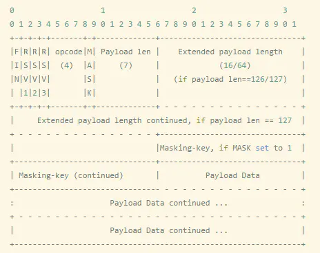
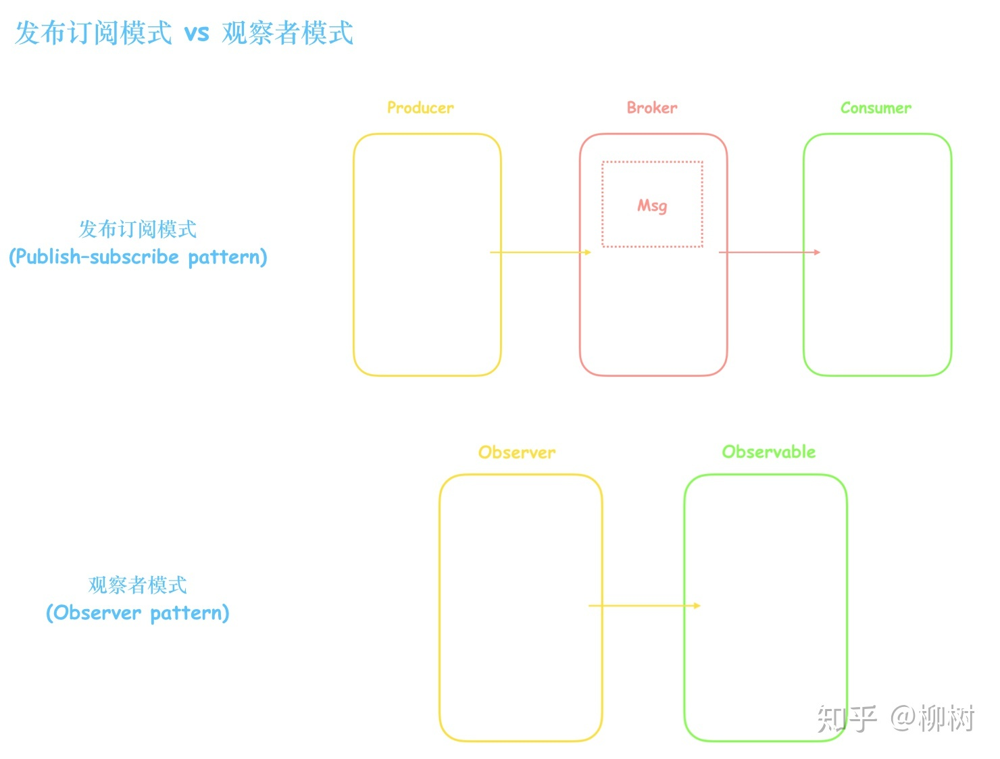

# instanceof底层原理
```js
功能：
instanceof 运算符用于测试构造函数的 prototype 属性是否出现在对象原型链中的任何位置
function instance_of(left, right) {
  const RP = right.prototype; // 构造函数的原型
  while(true) {
    if (left === null) {
      return false;
    }
    if (left === RP) { // 一定要严格比较
      return true;
    }
    left = left.__proto__; // 沿着原型链重新赋值
  }
}
console.log(Number instanceof Number)  // false
console.log(String instanceof String)  // false
console.log(null instanceof Object)   // false
```
# typeof
```js
console.log(typeof undefined)  //'undefined'
console.log(typeof true)    //'Boolean'
console.log(typeof "abc")   //'string'
console.log(typeof 123)           //'number'
console.log(typeof function(){})  //'function'
console.log(typeof null)
console.log(typeof {})
console.log(typeof [])
console.log(typeof new Symbol()) //'symbol'
判断对象与数组
1. instanceof 
2. constructor 
arr.constructor === Array 
3. Object.prototype.toString.call(a) === '[object Array]';//true  
4. Array.isArray()
```
# axios、fetch、ajax的区别
[axios、fetch、ajax](https://www.cnblogs.com/lyq1996/p/14485344.html)
```js
fetch()方法是暴露在全局作用域中的，包括主页面执行线程、模块和工作线程。调用这个方法，
浏览器就会向给定 URL 发送请求
```
# 如何实现 new 运算符
```js
1. 创建一个空对象，作为将要返回的实例对象。
2. 将这个空对象的原型，指向构造函数的prototype属性。
3. 将这个空对象赋值给函数内部的this关键字。
4. 开始执行构造函数内部的代码。
5. 如果构造函数内有返回值且为对象类型，则返回该对象，否则返回上面创建的实例对象。
// 参考js下的文件
let new2 = function(func) { 
  //创建一个空对象 o，并且继承构造函数的原型对象
  let o = Object.create(func.prototype);
  //执行构造函数，并且上下文 this 指向 o 对象
  let k = func.call(o);
  //如果构造函数返回的是对象就返回该对象，否则返回 o 对象
  if(typeof k === 'object') {
    return k
  }else {
    return o
  }
}
```
# arguments
arguments 是一个类似数组的对象, 对应于传递给函数的参数。
arguments对象是所有函数中可用的局部变量。你可以使用arguments对象在函数中引用函数的参数。
```js
将 arguments 转换为真正的数组:
let args = Array.from(arguments);
let args = [...arguments];
```
```js
// 属性
1. arguments.callee 指向当前执行的函数。
2. arguments.caller 指向调用当前函数的函数。
3. arguments.length 指向传递给当前函数的参数数量。
```
# 图片懒加载、预加载
```js
图片预加载：就是在网页全部加载之前，提前加载图片，当用户需要查看时可直接从本地缓存中渲染，以提供给用户更好的体验，减少等待的时间。
图片懒加载（缓载）：延迟加载图片或符合某些条件时才加载某些图片。
懒加载的好处：
1. 能提升用户的体验
2. 减少无效资源的加载
3. 防止并发加载的资源过多会阻塞js的加载
1. 懒加载的实现
  <html lang="en">
  <head>
    <meta charset="UTF-8">
    <title>Lazyload</title>
    <style>
      .image-item {
        display: block;
        margin-bottom: 50px;
        height: 200px; 
        /* 一定记得设置图片高度 */
      }
    </style>
  </head>
  <body>
    
    
    
    
    
    
    
    
    
    
    
    
    <script>
    // 方式一
      var viewHeight = document.documentElement.clientHeight//获取可视区高度
      function lazyload() {
        var eles = document.querySelectorAll('img[data-original][lazyload]')
        Array.prototype.forEach.call(eles, function (item, index) {
          var rect
          if (item.dataset.original === "")
            return
          rect = item.getBoundingClientRect()// 用于获得页面中某个元素的左，上，右和下分别相对浏览器视窗的位置
          if (rect.bottom >= 0 && rect.top < viewHeight) {
            !function () {
              var img = new Image()
              img.src = item.dataset.original
              img.onload = function () {
                item.src = img.src
              }
              item.removeAttribute("data-original")//移除属性，下次不再遍历
              item.removeAttribute("lazyload")
            }()
          }
        })
      }
      lazyload()//刚开始还没滚动屏幕时，要先触发一次函数，初始化首页的页面图片
      document.addEventListener("scroll",lazyload)
      // 方式二：echo.js

    </script>
  </body>
  </html>

2. 预加载
    1. 使用css进行图片预加载
    body:after {
        content: "";
        display: block;
        position: absolute;
        background: url("../image/...") no-repeat 0 0；
        height: 0
    }
    2. 使用css+js进行图片预加载
      .preload-img:after{
            content:"",
            background: url("../image/...") no-repeat 0 0；
        }
      $(function(){
          $("#img").addClass("preload-img")
      })
      // 另一种使用数组先保存图片，然后遍历查找值
    3. 使用ajax
    window.onload = function() {  
      setTimeout(function() {  
          // XHR to request a JS and a CSS  
          var xhr = new XMLHttpRequest();  
          xhr.open('GET', 'http://domain.tld/preload.js');  
          xhr.send('');  
          xhr = new XMLHttpRequest();  
          xhr.open('GET', 'http://domain.tld/preload.css');  
          xhr.send('');  
          // preload image  
          new Image().src = "http://domain.tld/preload.png";  
      }, 1000);  
    }; 
    4. 使用PreloadJS库
```
# 实现页面加载进度条
```js
1. h5的progress
2. 根据请求的返回的加载进度
```
# 手动实现 parseInt
```js
const _parseInt = (str, radix) => {
  // 不为string类型先转化为string 类型
  if (typeof str !== 'string') str = String(str)
  // 删除首尾空白
  str = str.trim()
  // 正则匹配[+|-]?[0]?[Xx]?[0-9a-fA-F]+
  const regex = /^(?<fuhao>[\+|\-]*)(?<radix>[0]?[Xx]?)(?<num>[0-9a-fA-F]+)/
  // 无法匹配返回NaN
  if (!regex.test(str)) return NaN
  // 匹配出符号、进制、数字三个分组
  const groups = str.match(regex).groups
  // radix的有效范围为 2-36
  if (radix && (radix < 2 || radix > 36)) return NaN
  // 如果没有指定radix, radix 会有以下默认值
  if (!radix) {
    if (groups.radix.toUpperCase() === '0X') radix = 16
    else if (groups.radix === '0') radix = 8
    else radix = 10
  }
  // 挨个字符串解析，如果遇到无法解析时则停止解析，返回已经解析好的整数
  let splitArr = groups.num.split('')
  const arr = []
  for(let i = 0; i < splitArr.length; i++) {
    // 根据charCode来做转行为实际数据, 0-9为[48-57],A-F为[65-70]
    const charCode = splitArr[i].toUpperCase().charCodeAt()
    let num 
    // 字符为[A-F]时, 实际数字为charCode -55
    if(charCode >= 65) num = charCode - 55
    // 字符为[0-9]时, 实际数字为charCode - 48
    else num = charCode - 48
    // 当实际数字大于radix时, 无法解析则停止字符串遍历
    if (num > radix) {
      break
    } else {
      arr.push(num)
    }
  }
  const len = arr.length
  // 当实际数字数组长度为0时, 返回NaN
  if(!len) return NaN
  let result = 0
  // 依次解析实际数字数组, 组合成真正的数字
  for(let i = 0; i < len; i++) {
    const num = arr[i] * Math.pow(radix, len - i - 1)
    result += num
  }
  // 算法匹配到的正负号
  return result * (groups.fuhao === '-' ? -1 : 1)
}

```
# 手写实现promise
[promise](https://www.cnblogs.com/lyq1996/p/14171617.html)
# call，apply，bind 三者用法和区别，原生实现 bind call apply
```js
call（this,arg1,arg2,arg3）
apply(this,[arg1,arg2])
bind(this,arg1,arg2)
bind不会立即调用，而是返回一个新函数，其中的this指向是创建bind的第一个参数，其他则会使用为参数。
1. bind
//可以修改函数this指向。
//bind返回一个绑定了this的新函数boundFcuntion，例子中我们用bound表示。
//支持函数柯里化，我们在返回bound函数时已传递了部分参数2，在调用时bound补全了剩余参数。
//boundFunction的this无法再被修改，使用call、apply也不行。
Function.prototype.bind_ = function (obj) {
    if (typeof this !== "function") {
        throw new Error("Function.prototype.bind - what is trying to be bound is not callable");
    };
    var args = Array.prototype.slice.call(arguments, 1);
    var fn = this;
    //创建中介函数
    var fn_ = function () {};
    var bound = function () {
        var params = Array.prototype.slice.call(arguments);
        //通过constructor判断调用方式，为true this指向实例，否则为obj
        fn.apply(this.constructor === fn ? this : obj, args.concat(params));
    };
    fn_.prototype = fn.prototype;
    bound.prototype = new fn_();
    return bound;
};
2. call方法
Function.prototype._call = function(base, ...args) { // 拓展Function原型，使用Rest操作符接收剩余参数
    base = base || window; // 传递绑定的对象为null或undefined时指向window
    base.fn = this; // 调用_call时的this指向的是调用者也就是函数对象，将函数对象赋值给base对象的一个属性
    var result = base.fn(...args); // 调用base.fn时，fn中的this指针指向的是base，并使用Spread操作符展开参数传参
    delete base.fn; // 删除base对象的fn属性
    return result; // 将返回值返回
}
3. apply
Function.prototype._apply = function(base, args) { // 拓展Function原型
    base = base || window; // 传递绑定的对象为null或undefined时指向window
    base.fn = this; // 调用_apply时的this指向的是调用者也就是函数对象，将函数对象赋值给base对象的一个属性
    var result = base.fn(...args); // 调用base.fn时，fn中的this指针指向的是base，并使用Spread操作符展开参数传参
    delete base.fn; // 删除base对象的fn属性
    return result; // 将返回值返回
}
```
# 垃圾回收机制
```js
JavaScript 中的内存管理是自动执行的，而且是不可见的。
`可达性`
1. 有一组基本的固有可达值，由于显而易见的原因无法删除。例如:
本地函数的局部变量和参数
当前嵌套调用链上的其他函数的变量和参数
全局变量
还有一些其他的，内部的
这些值称为根。
2. 如果引用或引用链可以从根访问任何其他值，则认为该值是可访问的。
基本方法：
1. 标记清除法
标记根==>标记他们的引用以及子孙的引用==>不能访问的对象被认为是不可访问的，将被删除:
优化：
分代回收机制：新生代和老生代表。From和To两个空间。
增量回收
空闲时间收集
2. 引用计数
释放引用次数为0的值的内存
引用计数在代码中存在循环引用时会出现问题。
`内存管理`：
1. 通过 const 和 let 声明提升性能
2. 隐藏类和删除操作
3. `内存泄漏`
 ==================造成内存泄露的操作和内存泄露后的方法====================
 操作：1.  意外的全局变量
      2. 被遗忘的定时器或回调函数
      3. 脱离DOM的使用
      4. 闭包
方法： 1.  利用chorme的插件进行分析内存占用情况
      2. 在退出函数前将不使用的变量删除
      3. 避免变量的循环赋值和引用
4. 静态分配与对象池
```
# 闭包
```js
闭包使用的场景
1. 定时器
2. 回调
3. 函数的防抖节流
4. 封装私有变量
5. 函数柯里化
6. 不使用循环返回数组
```
# 变量提升、函数提升
```js
1. 函数提升优于变量提升执行
2. 变量提升只提升声明，函数提升声明和赋值
3. 变量声明不会覆盖变量或函数的赋值
4. 函数声明会覆盖同名的变量声明和函数赋值，但不会覆盖变量赋值!
5. 立即执行函数(IIFE)中存在局部作用域，变量只会提升到函数内的顶部
```
# websocket的原理
```js
 缺点：会出现半死不活的状态。因为中间存在巨大的网络链路，导致会发生断点连接失败
 HTTP 1.1中的keep-alive connection是指在一次TCP连接上完成多次请求，但是对每个请求都要单独发header
 WebSocket 看成是 HTTP 协议为了支持长连接所打的一个大补丁。建立在TCP之上的。
 `websocket分为握手和数据传输阶段，即进行了HTTP握手 + 双工的TCP连接。`
 1. 握手阶段
 客户端发送消息：
  GET /chat HTTP/1.1
  Host: server.example.com
  Upgrade: websocket
  Connection: Upgrade
  Sec-WebSocket-Key: dGhlIHNhbXBsZSBub25jZQ==
  Origin: http://example.com
  Sec-WebSocket-Version: 13
  服务端返回消息
  HTTP/1.1 101 Switching Protocols
  Upgrade: websocket
  Connection: Upgrade
  Sec-WebSocket-Accept: s3pPLMBiTxaQ9kYGzzhZRbK+xOo=
  `Sec-WebSocket-Key`:Base64 encode
 2. 传输阶段
  frame形式传输的
  a、大数据的传输可以分片传输，不用考虑到数据大小导致的长度标志位不足够的情况。
  b、和http的chunk一样，可以边生成数据边传递消息，即提高传输效率。
  
  [参数参考](https://www.jianshu.com/p/3444ea70b6cb)
 3. 使用
 var socket;
  $("#connect").click(function(event){
      socket = new WebSocket("ws://127.0.0.1:8000/chat");
      socket.onopen = function(){
      alert("Socket has been opened");
      }
      socket.onmessage = function(msg){
      alert(msg.data);
      }
      socket.onclose = function() {
      alert("Socket has been closed");
      }
  });
  $("#send").click(function(event){
      socket.send("send from client");
  });
  $("#close").click(function(event){
      socket.close();
  })
```
# js的内置对象有哪些？
```js
1. 值属性：Infinity、NaN、null、undefined
2. 函数属性：eval()、parseFloat()、parseInt()
3. 基本对象：Object、Function、Boolean、Error
4. 数字和日期对象
5. 字符串
6. 可索引的集合对象
7. 使用键的集合对象
8. 矢量集合
9. 结构化数据，如JSON
10. Promise、Reflect、Proxy
11. arguments
```
# 继承
```js
1. 原型链继承
注意：通过此方法继承时，不能使用对象字面量创建原型方法，因为会重写原型链。
缺点：1.引用类型的原型共用，会影响所有的实例。2.构建实例时，不能向里边传入参数。不能与构造函数一样。
2. 借用构造函数继承 (经典继承)
思路：在子类构造函数中调用父类构造函数。
function Person(name){
  this.name=name;
}
function Second(){
  //即传入参数，又定义自己的属性
Person.call(this,'qwqw')
this.age=12;
}
let s=new Second();
console.log('s.name',s.name);
console.log('s.age',s.age);
缺点：方法都在构造函数中定义，函数不能复用。
3. 组合继承
思路：使用原型链继承原型上的属性和方法，而通过盗用构造函数继承实例属性
4. 原型式继承
思想：实现对象之间的信息共享
    // function object(o){
    //   function F(){};
    //   F.prototype=o;
    //   return new F();
    // }
    var person={
      name:'ssss',
      friends:['k','l','o']
    }
    var another=Object.create(person,{
      name:{
        value:"SSS"
      }
    });
    alert(another.name)  //SSS
5. 寄生式继承
思路：创建一个实现继承的函数，以某种方式增强对象，然后返回这个对象。
function createAnother(original){ 
 let clone = object(original); // 通过调用函数创建一个新对象
 clone.sayHi = function() { // 以某种方式增强这个对象
   console.log("hi"); 
 }; 
 return clone; 
}// 返回这个对象
======使用=======
let person = { 
 name: "Nicholas", 
 friends: ["Shelby", "Court", "Van"] 
};
let anotherPerson = createAnother(person); 
anotherPerson.sayHi(); // "hi"
}
缺点：
6. 寄生式组合继承
function inheritPrototype(subType, superType) { 
 let prototype = object(superType.prototype); // 创建对象
 prototype.constructor = subType; // 增强对象 
 subType.prototype = prototype; // 赋值对象
}
function SuperType(name) { 
 this.name = name; 
 this.colors = ["red", "blue", "green"]; 
} 
SuperType.prototype.sayName = function() { 
 console.log(this.name); 
}; 
function SubType(name, age) { 
 SuperType.call(this, name); 
 this.age = age; 
} 
inheritPrototype(SubType, SuperType); 
SubType.prototype.sayAge = function() { 
 console.log(this.age); 
};
```
# 原型和原型链
```js
`原型`
js中的对象，都有其对应的prototype属性，其中包含共享的属性和方法。
`原型链`
每个构造函数都有一个原型对象，原型有一个属性指回构造函数，而实例有一个内部指针指向原型。如果原型是另一个类型的实例呢？那就意味
着这个原型本身有一个内部指针指向另一个原型，相应地另一个原型也有一个指针指向另一个构造函
数。这样就在实例和原型之间构造了一条原型链。
```
# 观察者模式，和发布订阅模式，有什么区别？
```js
1. 观察者模式：实现松耦合(loosely coupled)
观察者模式里面，changed()方法所在的实例对象，就是被观察者（Subject，或者叫Observable），它只需维护一套观察者（Observer）的集合，这些Observer实现相同的接口，Subject只需要知道，通知Observer时，需要调用哪个统一方法就好了：

```
# valueOf() toString()
{}的valueof()结果是{},toString的结果是[Object object]
[] 的valueof()结果是[],toString的结果是’’
```js
toString()方法：返回对象的字符串表示。
console.log('222'.toString())    // '222'
console.log((222).toString())           // '222'
0.toString();//Uncaught SyntaxError: Invalid or unexpected token
console.log({name:'22'}.toString())   // '[object Object]'
console.log(true.toString())     //'true'
console.log([1,3,4].toString())  //1 ,3,4
console.log(function(){alert('eee')}.toString())  //'function(){alert('eee')'
console.log(new Error('错误').toString())  //'Error: 错误'
console.log(new Date().toString())  //Wed Jul 28 2021 15:58:46 GMT+0800 (中国标准时间)
Date.toString();//"function Date() { [native code] }"
String.toString(); //"function String() { [native code] }"
RegExp.toString();//"function RegExp() { [native code] }"
========================================================================
valueOf()方法：返回指定对象的原始值
console.log('222'.valueOf())    // '222'
console.log((222).valueOf())           // 222
//0.valueOf();//Uncaught SyntaxError: Invalid or unexpected token
console.log({name:'22'}.valueOf())   // {name:'22'}
console.log(true.valueOf())     //true
console.log([1,3,4].valueOf())  //[1, 3, 4]
console.log(function(){alert('eee')}.valueOf())  //'function(){alert('eee')'
console.log(new Error('错误').valueOf())  //'Error: 错误'
console.log(new Date().valueOf())  //1627459767493
console.log(Date.valueOf())
Date.valueOf();//function Date() { [native code] }
String.valueOf(); //function String() { [native code] }
RegExp.valueOf();//function RegExp() { [native code] }
共同点：在 JavaScript 中，toString()方法和valueOf()方法，在输出对象时会自动调用。
不同点：二者并存的情况下，在数值运算中，优先调用了valueOf，字符串运算中，优先调用了toString。
共同的缺点：无法获取null和undefined的值
```
# tofixed()的原理
```js
四舍六入五成双:“四”是指≤4 时舍去，"六"是指≥6时进上，"五"指的是根据5后面的数字来定，当5后有数时，舍5入1；当5后无有效数字时，需要分两种情况来讲：①5前为奇数，舍5入1；②5前为偶数，舍5不进。（0是偶数）
function fixed(num, digits){
   let dig = Math.pow(10, digits);
   return Math.round(num * dig) / dig; //Math.round采用四舍五入的方法
}
```

# 作用域
```js
1. 全局作用域 ----global/window
全局变量拥有的作用域
在函数内部或代码块中没有定义的变量实际上是作为 window/global 的属性存在，而不是全局变量。
2. 函数作用域 ---- 'function'
在函数内部定义的局部变量所拥有的作用域，外部只能通过return 或者闭包访问到
3. 块级作用域 ---- {}
let
4. 动态作用域 ----this
this根据调用的不同，指向不同
```
# TCP UDP区别
TCP:
1. 面向连接
2. 仅支持单播传输
3. 面向字节流
4. 可靠传输
5. 提供拥塞控制
6. TCP提供全双工通信
UDP:
1. 面向无连接
2. 有单播，多播，广播的功能
3. UDP是面向报文的
4. 不可靠性
# 箭头函数能当做构造函数？箭头函数的this?
箭头函数的this是指向父级的，本身没有this
