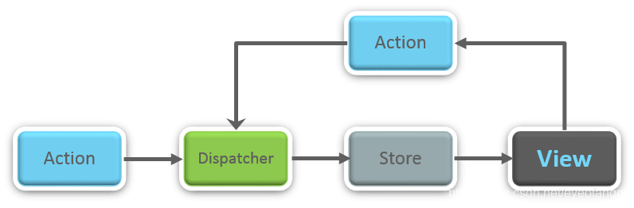

# 1.MVVM MVP MVC之间的区别？
```js
1. MVC
用户输入到Controller层
Controller层，发送View层和Model层，Model层修改数据，更新View层
`Controller 层触发 View 层时，并不会更新 View 层中的数据，View 层中的数据是通过监听 Model 层数据变化而自动更新的，与 Controller 层无关。`
缺点：
1. MVC 框架的大部分逻辑都集中在 Controller 层，代码量也都集中在 Controller 层，这带给 Controller 层很大的压力，而已经有独立处理事件能力的 View 层却没有用到。
2. Controller 层和 View 层之间是一一对应的，断绝了 View 层复用的可能，因而产生了很多冗余代码。
使用场景：
比如JavaEE中的SSH框架（Struts/Spring/Hibernate），Struts（View, STL）-Spring（Controller, Ioc、Spring MVC）-Hibernate（Model, ORM）以及ASP.NET中的ASP.NET MVC框架，xxx.cshtml-xxxcontroller-xxxmodel。
```
```js
2. MVP
Model-View-Presenter
用户输入到view层
Presenter层：Model层修改数据反馈给Presenter,Presenter反馈数据给View层
缺点：
1.所有数据都需要 Presenter 层进行“手动同步”，代码量比较大，
2. Presenter层逻辑复杂，难维护
```
```js
3.MVVM 框架
 ViewModel 层
 用户输入到View层，然后经过View层、ViewModel层、Model层。ViewModel层实现数据的双向绑定。
 View 层和 Model 层之间的修改都会同步到对方。
 方法：
1. 数据劫持
2. 发布-订阅模式
3. 脏值检查
`vue`使用的是数据劫持和发布-订阅模式两种方法。Observer：数据监听器 Compiler：指定解析器 Watcher：订阅者
`react`实现的是mvc中的View
```
# 2.React的生命周期
```js
类组件
挂载时顺序
constructor()
static getDerivedStateFromProps(props, state)
render()
componentDidMount()
更新时顺序
static getDerivedStateFromProps(props, state)
shouldComponentUpdate()
render()
static getSnapshotBeforeUpdate(prevProps, prevState)
componentDidUpdate()
卸载
componentWillUnmount()
1、getDrivedStatefromProps 这个生命周期的功能实际上就是将传入的 props 映射到 state 上面。
2、getDerivedStateFromProps 是静态方法不能用 this 直接调用组件中的方法
3、为了替代 componentWillReceiveProps 存在的
```
# 3. React 中setState更新state何时同步何时异步？
```js
this.setState是应当使用this.setState()，该方法接收两种参数：对象或函数。
对象：即想要修改的state
函数：接收两个函数，第一个函数接受两个参数，第一个是当前state，第二个是当前props，该函数返回一个对象，和直接传递对象参数是一样的，就是要修改的state；第二个函数参数是state改变后触发的回调。
1. setState何时同步何时异步？
由React控制的事件处理程序，以及生命周期函数调用setState不会同步更新state 。
React控制之外的事件中调用setState是同步更新的。比如原生js绑定的事件，setTimeout/setInterval等。
2. setState保证同步更新？
采用第二种,函数转换
3. setState中的为什么是异步？
react框架本身的性能机制所导致的。因为每次调用setState都会触发更新，异步操作是为了提高性能，将多个状态合并一起更新，减少re-render调用
React会将多个setState的调用合并为一个来执行，也就是说，当执行setState的时候，state中的数据并不会马上更新
```
# 4. react的diff算法
传统的diff算法通过循环递归遍历节点进行对比，其复杂度要达到O(n^3)，其中n是节点总数，效率十分低下
tree diff:
对树的每一层遍历，如果组件不存在了则会直接销毁
component diff:
1、同一类型的组件—继续比较下去—是否需要比较—shouldComponentUpdate
2、不同类型的组件，直接替换
element diff:
1、同一类型组件里—继续比较下去—常见类型：列表
2、比较产出（insert_makeup、move_existing、remove_node）
3、比较策略：
- 使用uuid也就是key对列表组件命名
- 先全部遍历一遍，确定要删除和新增的
- 确定需要remove
4、建议：uuid不要设置为数组的index,因为会变动，即使元素未发生变化
# 5. react router history和hash的区别和比较
```js
hash(地址栏 URL 中的#)
1、#后面的参数不作为请求路由，只是切换对应路由 path 对应的组件
特点：hash 虽然在 URL 中，但不会被包括在 HTTP，因为我们 hash 每次页面切换其实切换的#之后的内容，而#后的内容改变不会触发地址的改变，所以不存在向后台发出请求，对后端完全没有影响，因此改变 hash 不会重新加载页面
每次 hash 发生变化时都会调用 onhashchange 事件
优点：可以随意刷新
history(利用了浏览器的历史记录栈)
特点：利用了 HTML5 History Interface 中新增的 pushState()和 replaceState()方法
在当前已有的 back、forward、go 的基础之上，他们提供了对历史记录进行修改的功能。只是当它们执行修改时，虽然改变了当前的 URL，但浏览器不会立即向后端发送请求。history：可以通过前进后退控制页面的跳转，刷新是真实的改变 url
缺点：不能刷新，需要后端进行配置。由于 history 模式下是可以自由修改请求 url，当刷新时如果对对应地址进行匹配就会返回 404。但是在 hash 模式下是可以刷新的，前端路由修改的是#中的信息，请求时地址是不会变的
```
# 6.Fiber
Fiber分片：把耗时过长的任务分成很多小片，小片运行时间狠毒那，每个小片执行之后都给其他任务一个执行的机会，这样唯一的线程就不会被独占，其他依然有运行的机会
每个分片的数据结构就是Fiber

fiber架构主要引入了两个新的概念，一个是Time slicing时间分片，时间分片是利用了fiber的可中断、可继续的功能，每个渲染周期内都会留一部分的时间来响应用户的输入

一个是Suspense，这两者用来应该对cpu和网络问题，解决卡顿或白屏问题
# 7. React 性能优化
```js
Code Splitting
shouldComponentUpdate 避免重复渲染
异步按需加载，路由懒加载，路由监听器
组件尽可能的进行拆分、解耦
列表类组件优化，
比如：shouldComponentUpdate(nextProps, nextState)：React.PureComponent、Immutable，React.memo
bind 函数优化
非可控组件和可控组件区别是否受 state 影响
ReactDOMServer 进行服务端渲染组件
```
# 8. React 合成事件
```js
合成事件的一套机制：React 并不是将 click 事件直接绑定在 dom 上面，而是采用事件冒泡的形式冒泡到 documnet 上面，然后 React 将事件封装给正式的函数处理运行和处理。
dispatchEvent函数
```
# 9. React18
```js
1. 自动批处理以减少渲染
什么是批处理？：批处理是 React 将多个状态更新分组到单个重新渲染中以获得更好的性能。
例如，如果你在同一个点击事件中有两个状态更新，React 总是将它们分批处理到一个重新渲染中。如果你运行下面的代码，你会看到每次点击时，React 只执行一次渲染，尽管你设置了两次状态：
什么是自动批处理？:从 React 18 开始 createRoot，所有更新都将自动批处理，无论它们来自何处。
这意味着超时、承诺、本机事件处理程序或任何其他事件内的更新将以与 React 事件内的更新相同的方式进行批处理。
调度
2. Suspense 的 SSR 支持
3. startTransition
```
# 10. 你对 React 的 refs 有什么了解？
```js
它是一个有助于存储对特定的 React 元素或组件的引用的属性，它将由组件渲染配置函数返回。用于对 render() 返回的特定元素或组件的引用。当需要进行 DOM 测量或向组件添加方法时，它们会派上用场。
使用场景
1. 需要管理焦点、选择文本或媒体播放时
2. 触发式动画
3. 与第三方 DOM 库集成
```
# 11. flux、Redux、React-redux的不同

单向数据流：Action -> Dispatcher -> Store -> View
整个流程：
首先要有 action，通过定义一些 action creator 方法根据需要创建 Action 提供给 dispatcher
View 层通过用户交互（比如 onClick）会触发 Action
Dispatcher 会分发触发的 Action 给所有注册的 Store 的回调函数
Store 回调函数根据接收的 Action 更新自身数据之后会触发一个 change 事件通知 View 数据更改了
View 会监听这个 change 事件，拿到对应的新数据并调用 setState 更新组件 UI


```js
1.用户发出 Action。
store.dispatch(action);
2. Store 自动调用 Reducer，并且传入两个参数：当前 State 和收到的 Action。 Reducer 会返回新的 State 。
let nextState = todoApp(previousState, action);

3. State 一旦有变化，Store 就会调用监听函数。
// 设置监听函数
store.subscribe(listener);
4. listener可以通过store.getState()得到当前状态。如果使用的是 React，这时可以触发重新渲染 View。
function listerner() {
  let newState = store.getState();
  component.setState(newState);   
}
```
```js
//异步操作，采用中间件
import { applyMiddleware, createStore } from 'redux';
import createLogger from 'redux-logger';
const logger = createLogger();

const store = createStore(
  reducer,
  applyMiddleware(thunk, promise, logger)
);
```
[react-redux阮一峰](https://www.ruanyifeng.com/blog/2016/09/redux_tutorial_part_three_react-redux.html)
# 12.Hooks常用的
```js
1. useState
  定义值
  定义对象
  定义数组
  定义函数
使用注意：
  1）不支持局部更新
  2）当需要改变值时，必须通过setState修改，或者深拷贝一个新的数组进行更改在赋值
2. useEffect
componentDidMount， componentDidUpdate 和 componentWillUnmount 三个生命周期
副作用（DOM操作， 数据请求，组件更新）
  1）为什么在组件挂载之后请求数据？
  挂载前，当数据未请求回来或报错，会阻碍页面的渲染，组件挂载之后请求能实现无阻塞更新
  2）第二个参数的传参问题
  当第二个参数未填时，会监听所有的状态；
  当第二个参数为空数组时，不监听任何状态。只在页面初始时，监听
  当第三个参数是某一个状态时，只监听该状态，其余不监听，实现了componentDidUpdate
3. useRef
  useRef 返回一个可变的 ref 对象，其 .current 属性被初始化为传入的参数（initialValue）。返回的 ref 对象在组件的整个生命周期内保持不变。
  <div ref={myRef} /> .current 属性设置为相应的 DOM 节点。
4. useContext
  使用上下文，让组件之间也能有局部的全局变量。
  // 父组件
    const MyContext = createContext();
  // 子组件
    const ChildContext = () => {
        const count = useContext(MyContext);
        return (
            <h2>我是子组件{count}</h2>   
        );
    };
  {/* 父子传值， value为父组件准备传给子组件的值 */}
  <MyContext.Provider value={count}>
      <ChildContext />
  </MyContext.Provider>
5. useMemo
   与 shouldComponentUpdate 类似作用，在渲染过程中避免重复渲染的问题（提升性能）
   useMomo 和 useEffect 执行的时间不同，useEffect 是在 componentDidMount 以后执行的，而 useMemo 是在组件渲染过程中执行的。
   当第二个参数不传时，会监听所有状态并更新。
   当第二个参数为空数组时，不管状态变不变，都不更新
   当第三个参数是某一个状态时，只更新该状态，其余不更新
6. useCallback
   可以控制组件什么时候需要更新
   const callBack = useCallback(() => {
    console.log('count', count);
    return count;
  }, [count]);
```
