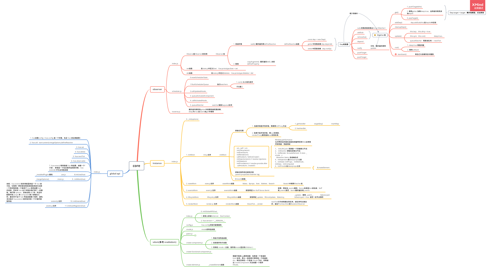

# vue的目录结构分析
1. compiler 目录包含Vue.js 所有编译相关的代码。它包括把所有模板解析成ast 语法树， ast 语法树优化等功能。
2. core 目录 包含了Vue.js 的核心代码，包括内置组件，全局API封装，Vue 实例化，观察者，虚拟DOM, 工具函数等等。
　(1) observer     相应系统，包含数据观测的核心代码。
　(2) vdom     包含虚拟DOM 创建（creation）和打补丁(patching) 的代码
　(3) instance  包含Vue 构建函数设计相关的代码
  (4) global-api   包含给Vue 构造函数挂在全局（静态方法）或属性的代码
 （5）components  包含抽象出来的通用组件
3. platform 不同的平台的处理
4. server
5. flow   类声明，检查器
6. examples  存放一些使用Vue 开发的应用案例
7. sfc 通常我们开发 Vue.js 都会借助 webpack 构建，然后通过.vue 单文件来编写组件。
8. shared 保存常用的变量和工具函数
9. types  常用的变量的保存
