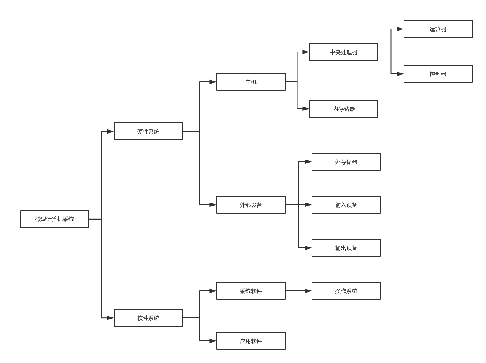

# 1. 系统组成
```js
包含两部分：硬件系统和软件系统
`硬件系统`一般指用电子器件和机电装置组成的计算机实体。如电源、显示器、主机箱等。
微处理器送出三组总线：地址总线（AB）、数据总线（DB）和控制总线（CB）。其他电路（常称为芯片）都可连接到这三组总线上。由微处理器和内存储器构成微型计算机的主机。此外，还有外存储器、输入设备和输出设备，它们统称为外部设备。
`软件系统`：指在硬件设备上运行的各种程序以及有关说明资料的总称
```

```js
微型计算机总线
1. 数据总线：用于微处理器、存储器和输入/输出设备之间传送数据。
2. 地址总线：用于传送存储器单元地址或输入/输出接口地址信息。
3. 控制总线：用于传送控制器的各种控制信号，包括命令和信号交换联络线及总线访问控制线等。
```
```js
位（bit）: 最小的数据单位是二进制的一个位数
字节（Byte）: 为了表示数据中的所有字符（字母、数字以及各种专用符号，大约有256个），需要用7位或8位二进制数。
字： 字是计算机进行数据存储和数据处理的基本运算单位。字是由若干字节组成的（通常取字节的整数倍）
`字符编码`就是规定用怎样的二进制编码来表示文字和符号
ASCII码、汉字编码
```
```js
`程序设计语言`：机器语言（每一条指令是由0和1组成的代码串）、汇编语言（汇编语言：用助记符代替二进制指令的语言）和高级语言三类。
`语言处理程序`:
 汇编程序: 汇编程序可将用汇编语言编写的程序（源程序）翻译成机器语言程序（目标程序），这一翻译过程称为汇编。
 编译程序: 可将用高级语言编写的程序（源程序）翻译成机器语言程序（目标程序），这个翻译过程称为编译。
 解释程序: 是边扫描、边翻译、边执行的翻译程序，解释过程不产生目标程序
```
```js
微型计算机的主要性能指标: 字长、内存容量、存取周期、主频（CPU的时钟频率，单位MHz（兆赫兹））、运算速度（每秒钟执行指令的数量，单位MIPS（百万条指令/秒））
操作系统的功能：处理器管理、存储管理、设备管理、文件管理、作业管理
```


```js
OSI 七层模型介绍
应用层：为应用程序提供网络服务（HTTP FTP TFTP SMTP SNMP DNS TELNET HTTPS POP3 DHCP）
表示层：数据格式化、加密、解密 (JPEG、ASCll、EBCDIC、加密格式等)
会话层：建立、维护、管理会话连接
传输层：建立、维护、管理端到端的连接 （TCP UDP）
网络层：(ip协议、ARP协议、ICMP IGMP IP（IPV4 IPV6）) 主要任务是为要传输的分组选择一条合适的路径，使发送分组能够准确无误地按照给定的目的地址找到目的主机。
数据链路层：控制网络层和物理层之间的通信。帧传输
物理层：比特流传输
```

