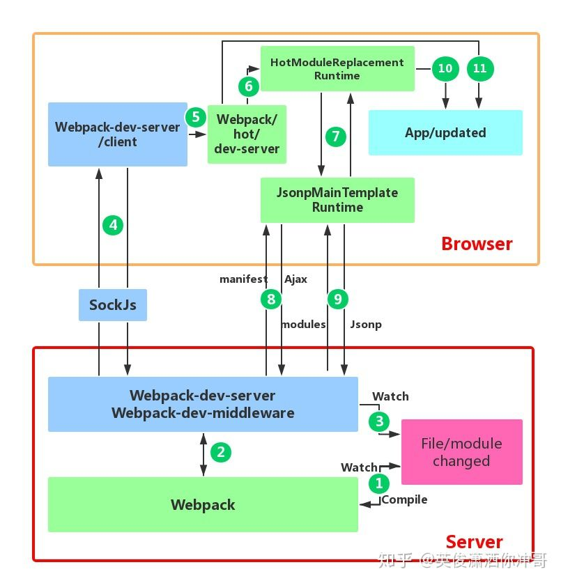
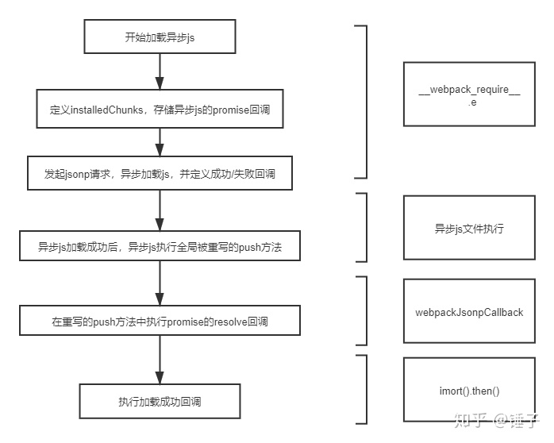

# 打包工具
```js
grunt ， gulp，webpack， rollup，parcel(零配置版webpack)
1. Grunt
最老牌的打包工具，它运用配置的思想来写打包脚本，一切皆配置，所以会出现比较多的配置项。
2. Gulp
用代码方式来写打包脚本。
`Grunt、Gulp两个是基于任务和流的。`
3. webpack
是模块化管理工具和打包工具，通过 loader 的转换，任何形式的资源都可以视作模块，比如 Commonjs 模块、AMD 模块、ES6 模块、CSS、图片等。它可以将许多松散的模块按照依赖和规则打包成符合生产环境部署的前端资源。还可以将按需加载的模块进行代码分隔，等到实际需要的时候再异步加载。 Gulp/Grunt 属于构建工具
4. Rollup 
利用 ES6 模块设计，利用 tree-shaking生成更简洁、更简单的代码。
```
# 与webpack类似的工具还有哪些？谈谈你为什么最终选择（或放弃）使用webpack？
```js
webpack
rollup
parcel
从应用场景上来看：
    webpack适用于大型复杂的前端站点构建
    rollup适用于基础库的打包，如vue、react
    parcel适用于简单的实验性项目，他可以满足低门槛的快速看到效果
```
# 有哪些常见的Loader？他们是解决什么问题的？
```js
babel-loader：解析 .js 和 .jsx 文件
tsx-loader：处理 ts 文件
less-loader：处理 less 文件，并将其编译为 css
sass-loader：处理 sass、scss 文件，并将其编译为 css
css-loader：处理 css 文件
style-loader：将 css 注入到 DOM
file-loader：将文件上的import  /  require 解析为 url，并将该文件输出到输出目录中
url-loader：用于将文件转换成 base64 uri 的 webpack 加载程序
html-loader：将 HTML 导出为字符串， 当编译器要求时，将 HTML 最小化
```
# 有哪些常见的Plugin？他们是解决什么问题的？
```js
html-webpack-plugin：生成 html 文件，并将包添加到 html 中
webpack-parallel-uglify-plugin：压缩 js（多进程并行处理压缩）
happypack：多线程loader，用于提升构建速度
hard-source-webpack-plugin：为模块提供中间缓存步骤，显著提高打包速度
webpack-merge：合并 webpack 配置
mini-css-extract-plugin：抽离 css
optimize-css-assets-webpack-plugin：压缩 css
add-asset-html-webpack-plugin：将 JavaScript 或 CSS 资产添加到 html-webpack-plugin 生成的 HTML 中
```
# webpack的构建流程是什么?
```js
Webpack 的运行流程是一个串行的过程，从启动到结束会依次执行以下流程：
初始化参数：从配置文件和 Shell 语句中读取与合并参数，得出最终的参数；
开始编译：用上一步得到的参数初始化 Compiler 对象，加载所有配置的插件，执行对象的 run 方法开始执行编译；
确定入口：根据配置中的 entry 找出所有的入口文件；
编译模块：从入口文件出发，调用所有配置的 Loader 对模块进行翻译，再找出该模块依赖的模块，再递归本步骤直到所有入口依赖的文件都经过了本步骤的处理；
完成模块编译：在经过第4步使用 Loader 翻译完所有模块后，得到了每个模块被翻译后的最终内容以及它们之间的依赖关系；
输出资源：根据入口和模块之间的依赖关系，组装成一个个包含多个模块的 Chunk，再把每个 Chunk 转换成一个单独的文件加入到输出列表，这步是可以修改输出内容的最后会；
输出完成：在确定好输出内容后，根据配置确定输出的路径和文件名，把文件内容写入到文件系统。
在以上过程中，Webpack 会在特定的时间点广播出特定的事件，插件在监听到感兴趣的事件后会执行特定的逻辑，并且插件可以调用 Webpack 提供的 API 改变 Webpack 的运行结果。
```
# webpack的热更新是如何做到的？说明其原理？

```js
1. webpack的watch监听重新编译打包，并将打包后的代码保存到内存。
2. webpack-dev-server 和 webpack 之间的接口交互。webpack-dev-middleware调用webpack 暴露的 API对代码变化进行监控，并且告诉 webpack，将代码打包到内存中。
3. webpack-dev-server 对文件变化的一个监控。devServer.watchContentBase 为 true 的时候，变化后会通知浏览器端对应用进行 live reload。浏览器刷新。
4. sockjs建立一个websocket长连接，将打包后的信息（最主要的hash值）传送给浏览器端。
5. webpack/hot/dev-server根据信息决定是否进行模块热更新或者浏览器刷新
6. HotModuleReplacement.runtime是重要的部分。它通过 JsonpMainTemplate.runtime 向 server 端发送 Ajax 请求，服务端返回一个 json，该 json 包含了所有要更新的模块的 hash 值，获取到更新列表后，该模块再次通过 jsonp 请求，获取到最新的模块代码。
`HMR 的工作流中，不应该把新模块代码放在 websocket 消息中。`
`EventSource`:服务器发送事件，在服务器这边接收 
7. HotModulePlugin对新旧模块进行对比，模块更新以及更新模块之间的依赖关系。
8. 当HMR失败后，回退到live reload操作，进行浏览器刷新来获取最新打包代码。
```
# 如何利用webpack来优化前端性能？（提高性能和体验）
```js
1. 优化打包速度
   1. 缩小文件的范围
    配置alias、配置includes exclude减少webpack loader的搜索、配置noParse
   2. 使用HappyPack开启多进程Loader转换
   3. thread-loader
   把loader放置在一个worker池里面运行，以达到多线程构建
   4. 抽离第三方模块
      内置的DllPlugin DllRefercePlugin
   5. 配置缓存 cache-loader
   6. 提取公共代码
      多入口情况下，使用CommonsChunkPlugin来提取公共代码
2. 优化打包体积
   1. webpack-bundle-analyzer
   2. externals
   引用一个库，但是又不想让webpack打包，并且又不能影响在程序中以CMD、AMD或者window/global全局等方式进行使用
   3. tree-shaking和Scope Hoisting来剔除多余代码
   4. 按需加载
```
# npm打包时需要注意哪些？如何利用webpack来更好的构建？
```js
1. NPM模块需要注意以下问题：

  1. 要支持CommonJS模块化规范，所以要求打包后的最后结果也遵守该规则。
  2. Npm模块使用者的环境是不确定的，很有可能并不支持ES6，所以打包的最后结果应该是采用ES5编写的。并且如果ES5是经过转换的，请最好连同SourceMap一同上传。
  3. Npm包大小应该是尽量小（有些仓库会限制包大小）
  4. 发布的模块不能将依赖的模块也一同打包，应该让用户选择性的去自行安装。这样可以避免模块应用者再次打包时出现底层模块被重复打包的情况。
  5. UI组件类的模块应该将依赖的其它资源文件，例如.css文件也需要包含在发布的模块里。
2. 基于以上需要注意的问题，我们可以对于webpack配置做以下扩展和优化：
  1. CommonJS模块化规范的解决方案： 设置output.libraryTarget='commonjs2'使输出的代码符合CommonJS2 模块化规范，以供给其它模块导入使用
  2. 输出ES5代码的解决方案：使用babel-loader把 ES6 代码转换成 ES5 的代码。再通过开启devtool: 'source-map'输出SourceMap以发布调试。
  3. Npm包大小尽量小的解决方案：Babel 在把 ES6 代码转换成 ES5 代码时会注入一些辅助函数，最终导致每个输出的文件中都包含这段辅助函数的代码，造成了代码的冗余。4. 解决方法是修改.babelrc文件，为其加入transform-runtime插件
  5. 不能将依赖模块打包到NPM模块中的解决方案：使用externals配置项来告诉webpack哪些模块不需要打包。
  6. 对于依赖的资源文件打包的解决方案：通过css-loader和extract-text-webpack-plugin来实现
```
# webpack实现原理
```js
const fs = require('fs')
const path = require('path')
const options = require('./webpack.config')
const parser = require('@babel/parser')
const traverse = require('@babel/traverse').default
const { transformFromAst } = require('@babel/core')

const Parser = {
  //2.解析入口文件,获取 AST
  getAst: path => {
    // 读取入口文件
    const content = fs.readFileSync(path, 'utf-8')
    // 将文件内容转为AST抽象语法树
    return parser.parse(content, {
      sourceType: 'module'
    })
  },
  // 3. 找出所有依赖模块
  getDependecies: (ast, filename) => {
    const dependecies = {}
    // 遍历所有的 import 模块,存入dependecies
    traverse(ast, {
      // 类型为 ImportDeclaration 的 AST 节点 (即为import 语句)
      ImportDeclaration({ node }) {
        const dirname = path.dirname(filename)
        // 保存依赖模块路径,之后生成依赖关系图需要用到
        const filepath = './' + path.join(dirname, node.source.value)
        dependecies[node.source.value] = filepath
      }
    })
    return dependecies
  },
  getCode: ast => {
    // 4. AST 转换为 code
    const { code } = transformFromAst(ast, null, {
      presets: ['@babel/preset-env']
    })
    return code
  }
}
//1. 定义 Compiler 类
class Compiler {
  constructor(options) {
    // webpack 配置
    const { entry, output } = options
    // 入口
    this.entry = entry
    // 出口
    this.output = output
    // 模块
    this.modules = []
  }
  // 构建启动
  run() {
    // 解析入口文件
    const info = this.build(this.entry)
    this.modules.push(info)
    this.modules.forEach(({ dependecies }) => {
      // 判断有依赖对象,递归解析所有依赖项
      if (dependecies) {
        for (const dependency in dependecies) {
          this.modules.push(this.build(dependecies[dependency]))
        }
      }
    })
    // 5. 递归解析所有依赖项,生成依赖关系图
    const dependencyGraph = this.modules.reduce(
      (graph, item) => ({
        ...graph,
        // 使用文件路径作为每个模块的唯一标识符,保存对应模块的依赖对象和文件内容
        [item.filename]: {
          dependecies: item.dependecies,
          code: item.code
        }
      }),
      {}
    )
    this.generate(dependencyGraph)
  }
  build(filename) {
    const { getAst, getDependecies, getCode } = Parser
    const ast = getAst(filename)
    const dependecies = getDependecies(ast, filename)
    const code = getCode(ast)
    return {
      // 文件路径,可以作为每个模块的唯一标识符
      filename,
      // 依赖对象,保存着依赖模块路径
      dependecies,
      // 文件内容
      code
    }
  }
  // 6. 重写 require函数 (浏览器不能识别commonjs语法),输出bundle
  generate(code) {
    // 输出文件路径
    const filePath = path.join(this.output.path, this.output.filename)
    // 懵逼了吗? 没事,下一节我们捋一捋
    const bundle = `(function(graph){
      function require(module){
        function localRequire(relativePath){
          return require(graph[module].dependecies[relativePath])
        }
        var exports = {};
        (function(require,exports,code){
          eval(code)
        })(localRequire,exports,graph[module].code);
        return exports;
      }
      require('${this.entry}')
    })(${JSON.stringify(code)})`

    // 把文件内容写入到文件系统
    fs.writeFileSync(filePath, bundle, 'utf-8')
  }
}

new Compiler(options).run()
```
# Webpack 怎么提取公共模块
```js
SplitChunksPlugin插件
module.exports = {
    ...
    // 公共模块提取
    optimization: {
        splitChunks: {
            chunks: 'all'
        }
    }
}
```
# webpack打包如何配置（单页面以及多页面）
```js
配置多个entry和多个HtmlWebpackPlugin
```
# webpack本地开发怎么解决跨域的?
```js
proxy
```
# webpack按需加载

```js
1. 有两种方式：import()---官方推荐 require.ensure()
webpack打包后的代码把import()语句换成了webpack自定义的webpack_require.e 函数。
创建promise，动态创建script加载对应的chunk（很显然chunk是在这里被动态加载的），chunk执行成功后触发resolve以执行后续流程。
`webpack根本没有把按需加载的chunk打包进bundle`
```
# babel原理
```js
本质：JavaScript 中 es2015/2016/2017/2046 的新语法转化为 es5，让低端运行环境(如浏览器和 node )能够认识并执行。
使用方法：
1. 使用单体文件 (standalone script)
2. 命令行 (cli)
3. 构建工具的插件 (webpack 的 babel-loader, rollup 的 rollup-plugin-babel)。
运行方式：
babel 总共分为三个阶段：解析，转换，生成。
babel 本身不具有任何转化功能，它把转化的功能都分解到一个个 plugin 里面。因此当我们不配置任何插件时，经过 babel 的代码和输入是相同的。
插件：
语法插件、转译插件
`preset`
1. 官方内容，目前包括 env, react, flow, minify 等。这里最重要的是 env，后面会详细介绍。
2. stage-x，这里面包含的都是当年最新规范的草案，每年更新。
  这里面还细分为
  Stage 0 - 稻草人: 只是一个想法，经过 TC39 成员提出即可。
  Stage 1 - 提案: 初步尝试。
  Stage 2 - 初稿: 完成初步规范。
  Stage 3 - 候选: 完成规范和浏览器初步实现。
  Stage 4 - 完成: 将被添加到下一年度发布。
 
```
